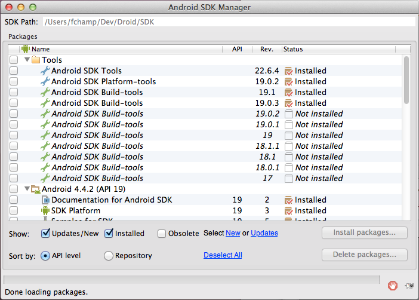
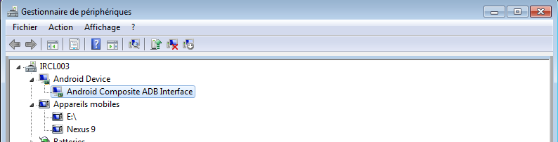
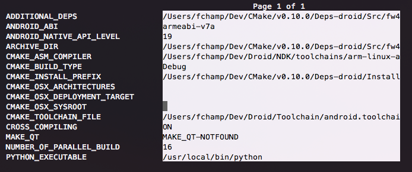
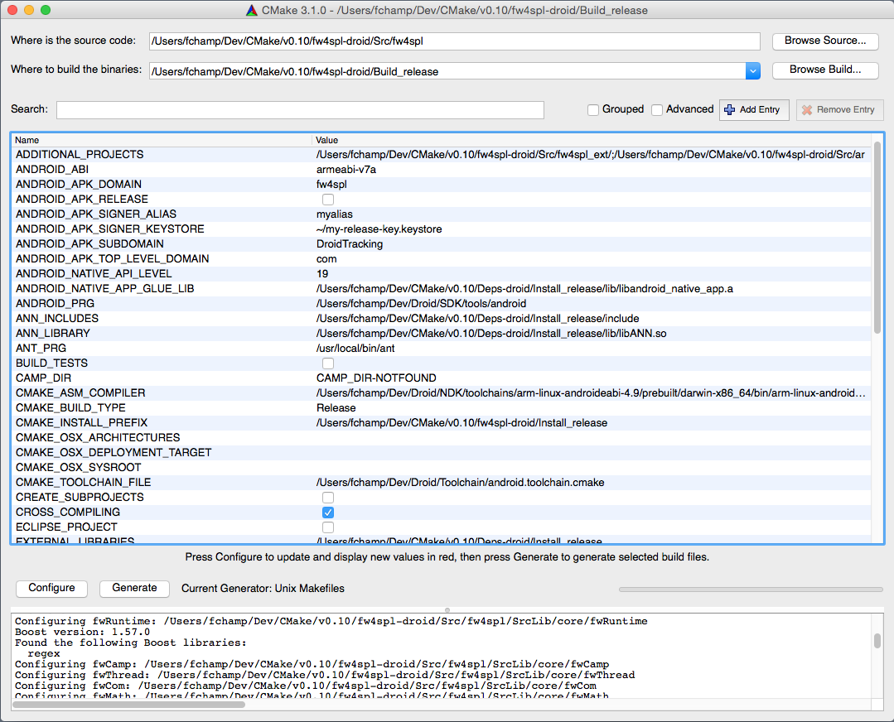
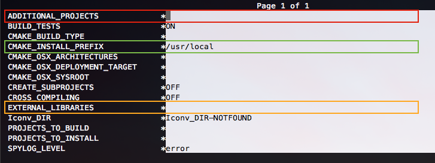

Installation for Android
=========================

.. figure:: ../media/fw4spl-droid_logo.png

This page summarizes the steps to build FW4SPL on Android.

.. warning::
    **Work in progress**

Android environnement
------------------------

The following tools are necessary:

* `JDK >= 6 <http://www.oracle.com/technetwork/java/javase/downloads/index.html>`_ (JRE only is not sufficient)
* `Gradle 2.13 <https://gradle.org/gradle-download/>`_ ou more recent

.. note::
    On Linux, openjdk is also reported to work well. You can easily install it with the packaging tools of your favorite distribution.

.. note::
    Since **OSX** 10.10 (Yosemite), `JDK 8 <http://www.oracle.com/technetwork/java/javase/downloads/jdk8-downloads-2133151.html>`_ is the minimal requirement.

SDK install
------------------------

The SDK is a set of libraries and development tools necessary to build, test and debug and Android application.
The initial archive you will download contains only the basic tools of the SDK. It doesn't contain any version of the API (Android Platform) and doesn't provide the whole set of tools you actually need to develop an application.

* Download the SDK archive:

    * `OSX <http://dl.google.com/android/android-sdk_r23.0.2-macosx.zip>`_
    * `Linux <http://dl.google.com/android/android-sdk_r23.0.2-linux.tgz>`_
    * `Windows <http://dl.google.com/android/android-sdk_r23.0.2-windows.zip>`_
* Extract the archive
* Set the environment variable *ANDROID_SDK* to its actual path

.. code:: bash

    # i.e for Linux and OSX
    export ANDROID_SDK=/ABSOLUTE/PATH/TO/THE/ANDROID_SDK

* The **SDK Manager** tool ease the downloading and the management of the different SDK versions, as well as the downloading of the development tools:

    * On Windows, **SDK Manager.exe** is located in the SDK root folder
    * On Linux and OSX, launch the following command in the SDK root folder :

.. code:: bash

    ./tools/android sdk

* You can also update the sdk directly through the command line:

.. code:: bash

   ./tools/android update sdk —no-ui

After that, you have to download at least one version of the API and one **Platform-tools** version. The latter contains the build tools (adb, etc...) and are updated independently of the SDK. More informations can be found `here <http://developer.android.com/tools/help/sdk-manager.html>`_.

.. warning::
    For the Windows users, it can be interesting to check that adb is well installed for your device by using the peripheral manager. If it's not the case, please try to update the drivers of your tablet/phone.

NDK install
------------------------

The NDK is the tool allowing people to develop some parts of your application using *native* code (C/C ++).
It also contains the system headers necessary to link successfully your librairies with the latest releases :

* libc (C library) headers
* libm (math library) headers
* JNI interface headers
* libz (Zlib compression) headers
* liblog (Android logging) header
* OpenGL ES 1.1 and OpenGL ES 2.0 (3D graphics libraries) headers
* libjnigraphics (Pixel buffer access) header (for Android 2.2 and above).
* A Minimal set of headers for C++ support
* OpenSL ES native audio libraries
* Android native application APIS

The NDK also provides a build system which will allow you to compile your source code without taking care of the toolchain/platform/CPU/ABI (*ABI = Application Binary Interface*).
You have to ensure to have the latest version of the SDK. Indeed, the NDK is compatible with the previous versions of the Android API, but this is not the case for the **Platform tools**.

* Download the NDK for your host platfom `here <https://developer.android.com/tools/sdk/ndk/index.html>`_ and extract the zip archive.

More informations can be found `here <https://developer.android.com/tools/sdk/ndk/index.html>`_.

Configuration for FW4SPL
------------------------

In order to obtain an Android development environment compatible with FW4SPL and its third-party libraries, you must fulfill the conditions below.

The APIs <= **8 (Froyo)** are not supported because of compilation error in boost. Thus it is recommended  to install the SDK Manager with the following versions versions:

* **Tools**:
    * Android SDK Tools >= 23.0.5.
    * Android SDK Platform-Tools >= 21.
    * Android SDL Build-tools >= 21.0.2.

* **Android 4.4.2 (API 21)**:
    * SDK Platform >= 21.

* On top of that, **Qt 5.x** does need multiple versions of the API (only download the SDK Platform):
    * **API 10** and **11** for QtMultimedia.
    * **API 16** for QtBase.

So don't forget to install them before building the FW4SPL deps.

You must also add the following environment variables.

.. code:: bash

    ANDROID_NDK=/PATH/TO/NDK
    ANDROID_SDK=/PATH/TO/SDK
    JAVA_HOME=/PATH/TO/JDK

Please remember that JAVA_HOME is the root folder of the JDK and not the binary folder.

.. warning::
    For windows, the path to the JDK binaries (java, javac, etc...) must also be in the PATH environment variable.

.. include:: CommonDeps.rst
    :end-before: Project configuration

Toolchain
~~~~~~~~~~~~~~~~~~~~~~~~~

The toolchain allows to cross-compile for Android by specifying all the necessary variables (compiler, target system, etc ...). Currently, the toolchain we use is a modified version of this `toochain <https://github.com/taka-no-me/android-cmake>`_ from the github user `taka-no-me <https://github.com/taka-no-me>`_ (fork of the OpenCV project).

* Download the toolchain:

.. code:: bash

    git clone https://github.com/fw4spl-org/android-cmake.git ~/Dev/Droid

Project configuration
~~~~~~~~~~~~~~~~~~~~~~~~~

To build the dependencies, you must configure the project with CMake into the Build folder. As any CMake based project, there are three different ways to perform that.

1. Command-line
+++++++++++++++++

In this case, you give all the necessary variables on the command-line in one shot :

.. code:: bash

    $ cd ~/Dev/Deps/Build/Debug
    $ cmake ../Src/fw4spl-deps -DCMAKE_INSTALL_PREFIX=~/Dev/Deps/Install/Debug -DCMAKE_BUILD_TYPE=Debug -DCROSS_COMPILING=ON -DANDROID_NATIVE_API_LEVEL=21 -DCMAKE_TOOLCHAIN_FILE=~/Dev/Droid/android.toolchain.cmake

2. NCurses based editor
+++++++++++++++++++++++++

This editor allows to set the required each variable in a more interactive way :

.. code:: bash

    $ cd ~/Dev/Deps/Build/Debug
    $ ccmake ../Src/fw4spl-deps

Then change the following CMake variables:

- ``CMAKE_INSTALL_PREFIX``: set the install location, here ``~/Dev/Deps/Install/Debug``
- ``CMAKE_BUILD_TYPE``: set the build type 'Debug' or 'Release'
- ``CROSS_COMPILING``: set to 'ON'

Press *"c"* to configure. Now you have got two new variables to set:

- ``ANDROID_NATIVE_API_LEVEL``: set to '21'
- ``CMAKE_TOOLCHAIN_FILE``: set to ~/Dev/Droid/android.toolchain.cmake

Press *"c"* to configure and then *"g"* to generate the makefiles.

3. Qt based gui
+++++++++++++++++

.. code:: bash

    $ cd ~/Dev/Deps/Build/Debug
    $ cmake-gui ../Src/fw4spl-deps

Like ccmake, change the following CMake variables:

- ``CMAKE_INSTALL_PREFIX``: set the install location, here ``~/Dev/Deps/Install/Debug``
- ``CMAKE_BUILD_TYPE``: set the build type 'Debug' or 'Release'
- ``CROSS_COMPILING``: set to 'ON'

Press *"c"* to configure. Now you have got two new variables to set:

- ``ANDROID_NATIVE_API_LEVEL``: set to '21'
- ``CMAKE_TOOLCHAIN_FILE``: set to ~/Dev/Droid/android.toolchain.cmake

Click on "configure" then "generate".

.. warning::
    Do not compile debug and release with the same Build and Install folders. If you followed the recommended folder layout, this should be fine.

.. warning::

    For Windows host platform, do not put the ``bin/`` folder of git in the PATH of your build terminal. It may cause troubles with Qt compilation (some Makefiles are badly generated with simple quotes).

.. include:: CommonSrc.rst
    :end-before: - Go into your Build directory

- Clone fw4spl-droid repository into your source directory:

.. code:: bash

    $ cd ..
    $ git clone https://github.com/fw4spl-org/fw4spl-droid.git fw4spl-droid
    $ cd fw4spl-droid
    $ git checkout master

.. include:: CommonSrc.rst
    :start-after: git checkout master
    :end-before: - Change the following cmake arguments

- Change the following cmake arguments
    - ``CMAKE_INSTALL_PREFIX``: set the install location (~/Dev/Install/Debug or Release)
    - ``CMAKE_BUILD_TYPE``: set to Debug or Release
    - ``EXTERNAL_LIBRARIES``: set the install path of the third party libraries you compiled before.(ex : ~/Dev/Deps/Install/Debug)
    - ``PROJECT_TO_BUILD``: set the list of the projects you want to build (ex: PoC09Android, ...), each project should be separated by ";"
    - ``PROJECT_TO_INSTALL``: set the name of the application to install
    - ``CROSS_COMPILING``: set to 'ON'

Press *"c"* to configure. Now you have got two new variables to set:

- ``ANDROID_NATIVE_API_LEVEL``: set to '21'
- ``CMAKE_TOOLCHAIN_FILE``: set to ~/Dev/Droid/android.toolchain.cmake

.. note::
    - If ``PROJECT_TO_BUILD`` is empty, all application will be compiled
    - If ``PROJECT_TO_INSTALL`` is empty, no application will be installed

Press *"c"* to configure and then *"g"* to generate the makefiles.

.. note::

    To generate the projects in release mode, change CMake argument ``CMAKE_BUILD_TYPE`` to ``Release`` **both** for fw4spl and fw4spl-deps

Then, according to the generator you chose, build FW4SPL with make :

.. code:: bash

    # Adjust the number of cores depending of the CPU cores and the RAM available on your computer
    $ make -j4

Or with ninja:

.. code:: bash

    $ ninja

If you didn't specify anything in ``PROJECT_TO_BUILD`` you may also build specific targets, for instance:

.. code:: bash

    $ ninja PoC09Android

To deploy the application, connect your Android device to the USB port, be sure that it is in `developer mode <http://www.androidexplained.com/enable-developer-mode/>`_ and that USB debugging is enabled. Then run:

.. code:: bash

    $ ninja install

Thanks to **Gradle** and **adb**, the application will be packaged and copied automatically to your device.
