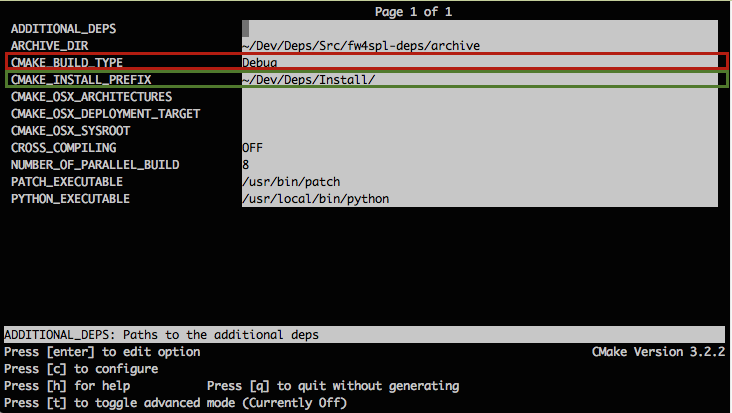

FW4SPL installation
-------------------------

FW4SPL uses CMake as build system.

We strongly recommend to build FW4SPL by separating source files, build files and install files.
So we propose the following folders layout :

    - Deps/Build/Debug
    - Deps/Build/Release
    - Deps/Src
    - Deps/Install/Debug
    - Deps/Install/Release
    - Dev/Build/Debug
    - Dev/Build/Release
    - Dev/Src
    - Dev/Install/Debug
    - Dev/Install/Release

Of course you can name the folders as you wish, or choose a different layout, but keep in mind to not build inside the source directory. This is strongly discouraged by *CMake* authors.

Here are the details, if you need some help to create this folders hierarchy :

- Create a third party folder (Deps)

.. code:: bash

    $ mkdir Deps

- Create into "Deps" the source, build and install directories

.. code:: bash

    $ mkdir Deps/Src Deps/Build Deps/Install

- Create sub-folders to separate Debug and Release compilations

.. code:: bash

    $ mkdir Deps/Build/Debug Deps/Build/Release Deps/Install/Debug Deps/Install/Release

- Then create a "Dev" directory, for FW4SPL

.. code:: bash

    $ mkdir Dev

- Create into "Dev" the source, build and install directories

.. code:: bash

    $ mkdir Dev/Src Dev/Build Dev/Install

- Create sub-folders to separate Debug and Release compilations

.. code:: bash

    $ mkdir Dev/Build/Debug Dev/Build/Release Dev/Install/Debug Dev/Install/Release

Dependencies
~~~~~~~~~~~~~~

We need first to build the third-party librairies. We will now fetch the scripts that allow to build them and then launch the compilation.

- Clone the repository into your source directory of Deps:

.. code:: bash

    $ cd Deps/Src
    $ git clone https://github.com/fw4spl-org/fw4spl-deps.git fw4spl-deps

- Go into fw4spl-deps folder and update to the latest stable version:

.. code:: bash

    $ cd fw4spl-deps
    $ git checkout master

- Go into your Build directory (Debug or Release) : here an example if you want to compile in DEBUG

.. code:: bash

    $ cd ../../..
    $ cd Deps/Build/Debug

Project configuration
++++++++++++++++++++++++

To build the dependencies, you must configure the project with CMake into the Build folder. As any CMake based project, there are three different ways to perform that.

1. Command-line
"""""""""""""""""

In this case, you give all the necessary variables on the command-line in one shot :

.. code:: bash

    $ cd ~/Deps/Build/Debug
    $ cmake ../../Src/fw4spl-deps -DCMAKE_INSTALL_PREFIX=~/Deps/Install/Debug -DCMAKE_BUILD_TYPE=Debug

2. NCurses based editor
"""""""""""""""""""""""""""""

This editor allows to set the required each variable in a more interactive way :

.. code:: bash

    $ cd ~/Deps/Build/Debug
    $ ccmake ../../Src/fw4spl-deps

Then change the following CMake variables:

- ``CMAKE_INSTALL_PREFIX``: set the install location, here ``~/Deps/Install/Debug``
- ``CMAKE_BUILD_TYPE``: set the build type 'Debug' or 'Release'

Press *"c"* to configure and then *"g"* to generate the makefiles.

3. Qt based gui
""""""""""""""""""

.. code:: bash

    $ cd ~/Deps/Build/Debug
    $ cmake-gui ../../Src/fw4spl-deps

Like ccmake, change the following CMake variables:

- ``CMAKE_INSTALL_PREFIX``: set the install location, here ``~/Deps/Install/Debug``
- ``CMAKE_BUILD_TYPE``: set the build type 'Debug' or 'Release'

Click on "configure" then "generate".

.. warning::
    Do not compile debug and release with the same Build and Install folders. If you followed the recommended folder layout, this should be fine.

