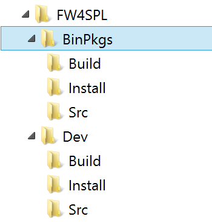
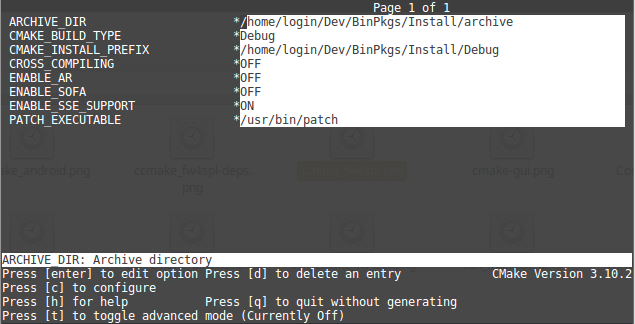

Source tree layout
~~~~~~~~~~~~~~~~~~~~~~

Good practices in FW4SPL recommend to separate source files, build and install folders. 
So to prepare the development environment, we propose to follow this layout:

* Create a development folder (Dev)

* Create a build folder (Dev/Build)

    * Add a sub folder for Debug and Release.
    
* Create a source folder (Dev/Src)

* Create an install folder (Dev/Install)

    * Add a sub folder for Debug and Release.

To prepare the third party environment:

* Create a third party folder (BinPkgs)

* Create a build folder (BinPkgs/Build)

    * Add a sub folder for Debug and Release.
    
* Create a source folder (BinPkgs/Src)

* Create an install folder (BinPkgs/Install) 

    * Add a sub folder for Debug and Release.                    

Of course you can name the folders as you wish, or choose a different layout, but keep in mind to not build inside the source directory. This is strongly discouraged by *CMake* authors.

Dependencies
-----------------

First, we need to build the third-party libraries. We will now fetch the scripts that allow to build them and then launch the compilation.

* `Clone <http://git-scm.com/book/en/v2/Git-Basics-Getting-a-Git-Repository#Cloning-an-Existing-Repository>`_ the following repository in the (BinPkgs/Src) source folder:

    * `fw4spl-deps <https://github.com/fw4spl-org/fw4spl-deps.git>`_

.. code:: bash

    $ cd Dev/BinPkgs/Src
    $ git clone https://github.com/fw4spl-org/fw4spl-deps.git

.. note:: *Optional*: 
    You may also clone this extension repository `fw4spl-ext-deps <https://github.com/fw4spl-org/fw4spl-ext-deps.git>`_, but it contains only experimental packages that are not needed for common tasks.

* Ensure that all the cloned repositories are on the same `branch <https://git-scm.com/docs/git-branch>`_.

* Update the cloned repositories to the lastest stable `tag <https://git-scm.com/book/en/v2/Git-Basics-Tagging>`_.

* Go into your Build directory (Debug or Release) : here is an example if you want to compile in DEBUG

.. code:: bash

    $ cd Dev/BinPkgs/Build/Debug

Configuration
~~~~~~~~~~~~~~~~

To build the dependencies, you must configure the project with CMake into the Build folder. As any CMake based project, there are three different ways to perform that.

1. Command-line
***************

In this case, you give all the necessary variables on the command-line in one shot :

.. code:: bash

    $ cd Dev/BinPkgs/Build/Debug
    $ cmake ../../Src/fw4spl-deps -DCMAKE_INSTALL_PREFIX=Dev/BinPkgs/Install/Debug -DCMAKE_BUILD_TYPE=Debug 

2. NCurses based editor
***********************

This editor allows to set the required each variable in a more interactive way :

.. code:: bash

    $ cd Dev/BinPkgs/Build/Debug
    $ ccmake ../../Src/fw4spl-deps
    

Then change the following CMake variables:

- ``CMAKE_INSTALL_PREFIX``: set the install location, here ``Deps/BinPkgs/Install/Debug``
- ``CMAKE_BUILD_TYPE``: set the build type 'Debug' or 'Release'
- ``ENABLE_SSE_SUPPORT``: enable SSE support. We need that to ensure coherency of the SSE support accross all dependencies. This option will also be forwarded to FW4SPL when building it.
- ``BUILD_FW4SPL-EXT-DEPS``: allows to enable/disable the **fw4spl-ext-deps** if you cloned it.

Press *"c"* to configure.

The following options are also available (some of the options will be needed for the optional source repositories):

    * ``ENABLE_AR``: Build **fw4spl-ar** dependencies (OpenCV, PCL, OpenIGTLink...).
    * ``ENABLE_OGRE``: Build Ogre3D and its dependencies (necessary for **fw4spl-ogre**).
    * ``ENABLE_CUDA``: Enable CUDA support in some libraries (OpenCV, PCL, libSGM). This requires `Cuda <https://developer.nvidia.com/cuda-downloads>`_ library to be installed on the system.
    * ``ENABLE_SOFA``: Build sofa.
    * ``ENABLE_EXTRAS`` : Build dependencies that are not used currently in the open-source repositories (Odil, Bullet, realsense, libSGM,...).
    * ``ENABLE_EXPERIMENTAL_DEPS``: Build experimental libraries (you shouldn't use it, moreover this option is only available with **fw4spl-ext-deps**).

When you're done, generate the code by pressing *"g"* on NCurses based editor or click on "generate" on gui.

.. warning::
    Do not compile debug and release with the same Build and Install folders. If you followed the recommended folder layout, this should be fine.

3. Qt based gui
***************

.. code:: bash

    $ cd ~/Dev/BinPkgs/Build/Debug
    $ cmake-gui ../../Src/fw4spl-deps

You can then edit the same options than with ``ccmake``.

