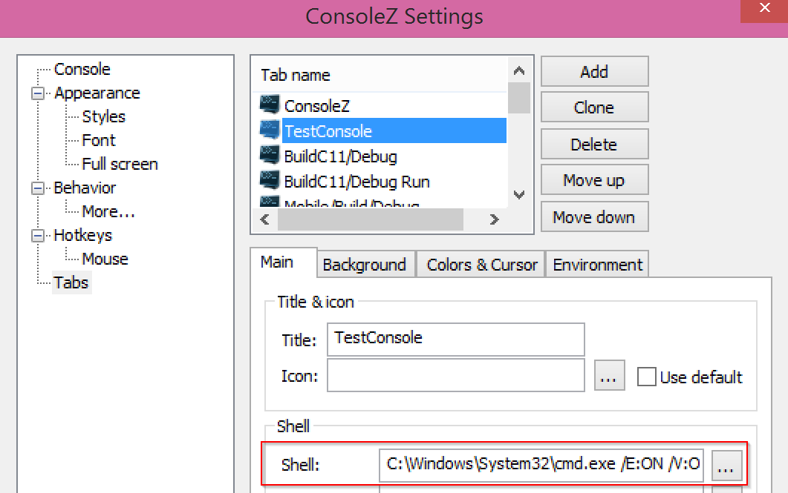

Installation for Windows
======================

Prerequisites for Windows users
--------------------------------

If not already installed:

1. Install `Mercurial <http://mercurial.selenic.com/wiki/>`_

2. Optionally you can install `TortoiseHg <http://tortoisehg.bitbucket.org/>`_

3. Install `Visual Studio 2013 Community <https://www.visualstudio.com/en-us/products/visual-studio-community-vs.aspx>`_

4. Install `Python 2.7 <https://www.python.org/downloads/>`_

5. Install `CMake <http://www.cmake.org/download/>`_

6. Install `jom <http://wiki.qt.io/Jom>`_

7. Install `ninja <https://github.com/martine/ninja/releases>`_

Qt is an external library used in FW4SPL. For the successful compilation of Qt with FW4SPL, please see the following requirements:

- http://wiki.qt.io/Building_Qt_5_from_Git

FW4SPL installation
-------------------------

FW4SPL works with data separation for source, build and install data. 
To prepare the development environment:

- Create a development folder (Dev)

- Create a build folder (Dev\\Build)

- Create a source folder (Dev\\Src)

- Create a install folder (Dev\\Install)

To prepare the third party environment:

- Create a third party folder (BinPkgs)

- Create a build folder (BinPkgs\\Build)

- Create a source folder (BinPkgs\\Src)

- Create a install folder (BinPkgs\\Install)

.. .. image:: media/Directories.png

Dependencies
~~~~~~~~~~~~~~~~~

For the third party libraries the three following repositories have to be `cloned <http://git-scm.com/book/en/v2/Git-Basics-Getting-a-Git-Repository#Cloning-an-Existing-Repository>`_ in the (BinPkgs) source folder:

- `fw4spl-deps <https://github.com/fw4spl-org/fw4spl-deps.git>`_

- `fw4spl-ar-deps <https://github.com/fw4spl-org/fw4spl-ar-deps.git>`_

- `fw4spl-ext-deps <https://github.com/fw4spl-org/fw4spl-ext-deps.git>`_

Update the cloned repositories to the used version. Make sure that cmake is set as environment variable. Call the cmake-gui or change the cmake arguments with the console from the BinPkgs build folder location. 
Choose jom as build tool (make sure jom was set as path variable to be found by cmake) for cmake. The following arguments have to be changed:

- *ADDITIONAL_PROJECTS*: set the source location of fw4spl-ar-deps and fw4spl-ext-deps

- *CMAKE_INSTALL_PREFIX*: set the install location.

Configure and generate the code. Compile the FW4SPL dependencies with jom in the console (e.g. jom all, jom qt, etc).

Source
~~~~~~~~~~~~~~~~~

For the FW4SPL source code the three following repositories have to be `cloned <http://git-scm.com/book/en/v2/Git-Basics-Getting-a-Git-Repository#Cloning-an-Existing-Repository>`_ in the (Dev) source folder:

- `fw4spl <https://github.com/fw4spl-org/fw4spl.git>`_

- `fw4spl-ar <https://github.com/fw4spl-org/fw4spl-ar.git>`_

- `fw4spl-ext <https://github.com/fw4spl-org/fw4spl-ext.git>`_

Update the cloned repositories to the used version. Make sure that cmake is set as environment variable. Call the cmake-gui or change the cmake arguments with the console from the Dev build folder location. 
Choose jom or ninja as build tool for cmake (make sure the build tool was set as path variable to be found by cmake). The following arguments have to be changed:

- *ADDITIONAL_PROJECTS*: set the source location of fw4spl-ar and fw4spl-ext

- *CMAKE_INSTALL_PREFIX*: set the install location.

- *EXTERNAL_LIBRARIES*: set the install path of the third part libraries.

Make sure the arguments concerning the compiler (advanced arguments) point to Visual Studio.
Configure and generate the code. Compile the FW4SPL source code with jom or ninja in the console . To develop applications with FW4SPL the source code can be imported and compiled with the preferred development environment. 

Launch an application
-------------------------

To work with an specific application or several applications the cmake argument *PROJECTS_TO_BUILD* can be set. 
After an successful compilation the application can be launched with the launcher.exe from FW4SPL. 
Therefore the profile.xml of the application in the build folder has to be passed as argument to the launcher call in the console. 
Make sure that the external libraries directory is set to the path (set PATH=C:\\FW4SPLBinPkgsInstallPath\\Debug\\bin;C:\\FW4SPLBinPkgsInstallPath\\Debug\\x64\\vc12\\bin;%PATH%).

.. image:: ../media/launchApp.png

Recommended software
-------------------------

The following programs may be helpful for your developments:

- Install `Eclipse CDT <https://eclipse.org/cdt/>`_. Eclipse is a multi-OS Integrated Development Environment (IDE) for computer programming. 
- Install `Notepad++ <http://notepad-plus-plus.org/>`_. Notepad++ is a free source code editor, which is designed with syntax highlighting functionality. 
- Install `ConsoleZ <https://github.com/cbucher/console/wiki/Downloads>`_. ConsoleZ is an alternative command prompt for Windows, adding more capabilities to the default Windows command prompt. To compile FW4SPL with the console the windows command prompt has to be set in the tab settings. 

Console settings
-------------------------

To use FW4SPL with the ConsoleZ or Console2 the following settings should be done:

-  The current directory should point to the build directory

-  Notify the windows command prompt as shell (e.g. C:\Windows\System32\cmd.exe /E:ON /V:ON /T:0E /K ), as default in debug mode

- Join .bat files to the shell settings, to indicate specific settings like path extensions to the external libraries of FW4SPL (e.g. set PATH=%PATH%;C:\FW4SPLBinPkgsInstallPath\Debug\bin;C:\FW4SPLBinPkgsInstallPath\Debug\x64\vc12\bin;) 

   
Release
-------------------------

To generate the projects in release, the following instruction has to be added:

- The console shell should be the windows command prompt in release mode (C:\Windows\System32\cmd.exe /E:ON /V:ON /T:0E /K  /release)

- Change CMake argument CMAKE_BUILD_TYPE to release

- Reference the EXTERNAL_LIBRARIES to the install folder of third part libraries compiled in release mode (for compiling the FW4SPL projects)