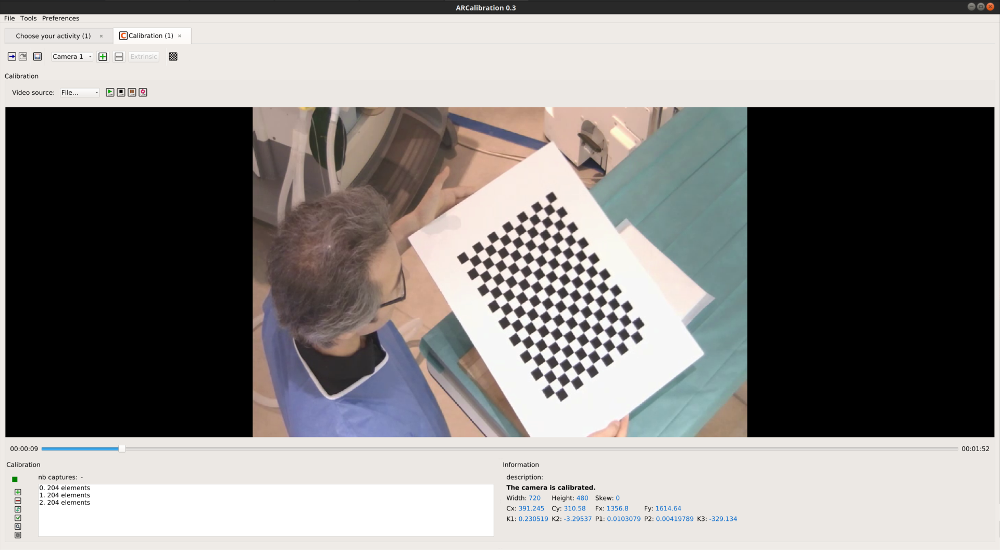
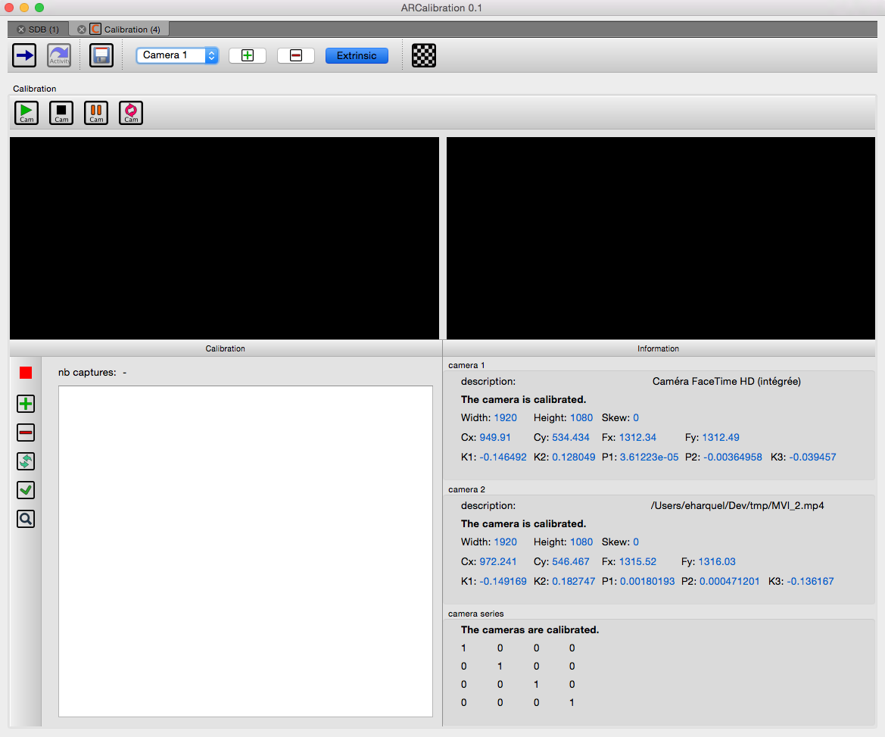

.. _fw4spl-ar:

***********
fw4spl-ar
***********

This repository contains functionalities for augmented reality. It is hosted on GitHub_.

.. _GitHub: https://github.com/fw4spl-org/fw4spl-ar

---------
Features
---------

This repository brings features for **Augmented Reality**:

- webcam, network video and local video playing based on QtMultimedia_,
- mono and stereo camera calibration,
- ArUco_ optical markers tracking,
- openIGTLink_ support through clients and servers services,
- TimeLine data, allowing to store buffers of various data (video, matrices, markers, etc...). These can be used to synchronize these data accross time.

.. _QtMultimedia: http://doc.qt.io/qt-5/qtmultimedia-index.html
.. _ArUco: https://sourceforge.net/projects/aruco/
.. _openIGTLink: http://openigtlink.org/

------------
Applications
------------

ARCalibration
~~~~~~~~~~~~~~

**ARCalibration**  is a user-friendly application to calibrate mono and stereo cameras. This software is a must-have since camera calibration is a mandatory step in any AR application.

    Mono camera intrinsic calibration.

    Stereo camera extrinsic calibration.

Examples
~~~~~~~~~~~~

==============================  ================================================================
 Name                           Concept
==============================  ================================================================
Ex01VideoTracking                Basic marker tracking on a video
Ex02TimeLine                     Basic producer-consumer pattern sample with timeLine data
Ex03Igtl                         Example of some of the *openIGTLink* features
Ex04SimpleARCV                   AR using a given transform matrix to register a mesh on a camera view
Ex05FrameByFrame                 Playing a video frame by frame
Ex06RGBDStream                   Playing a RGBD stream (from a RGBD camera or recorded images)
Ex07RGBDManualAR                 
ExSolvePnP                       Register a mesh on a video using SolvePnp (with user interaction)
ExStereoARCV                     Stereo AR using a given transform matrix to register a mesh on a camera view
ExVideoRecorder                  Record a video
==============================  ================================================================

