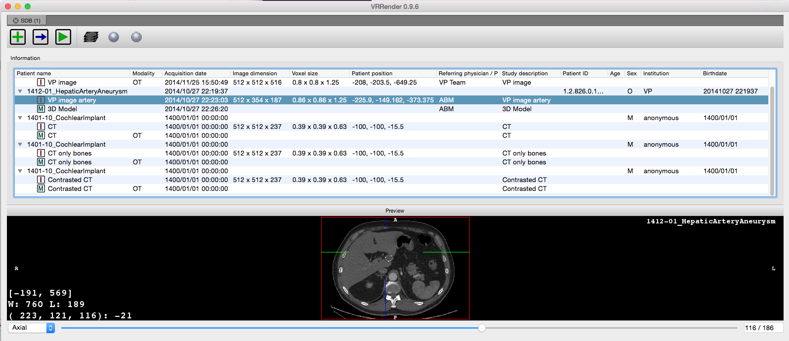
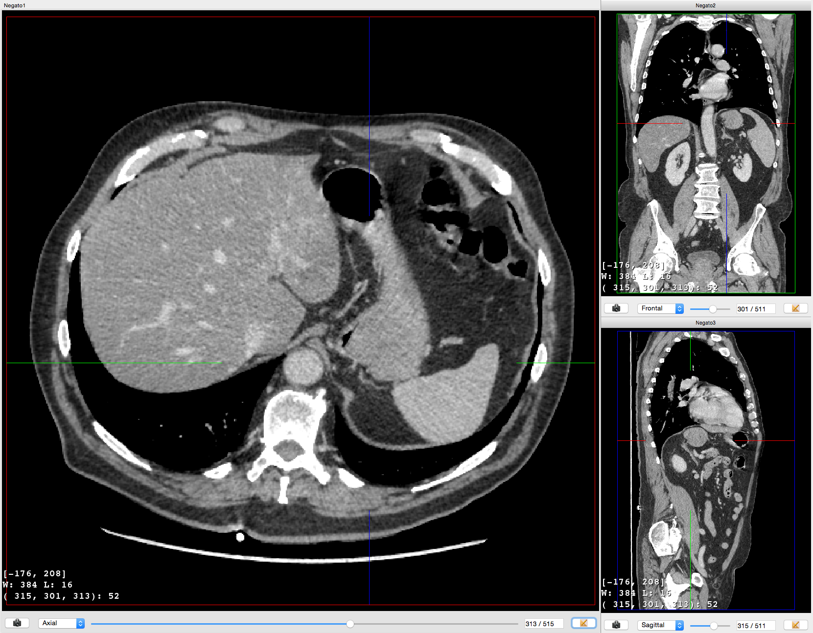
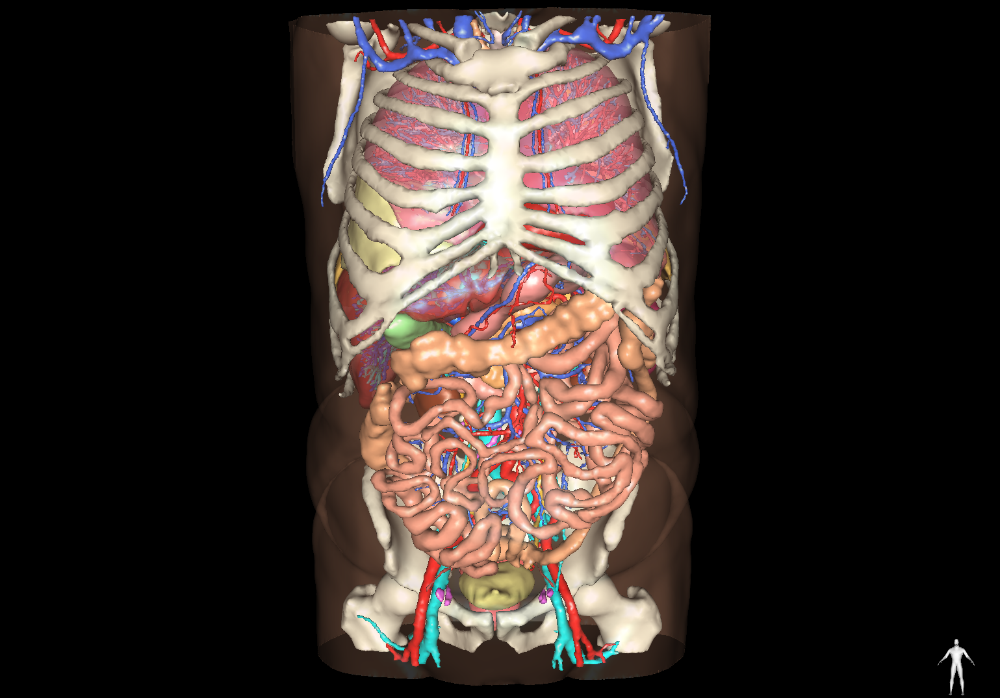
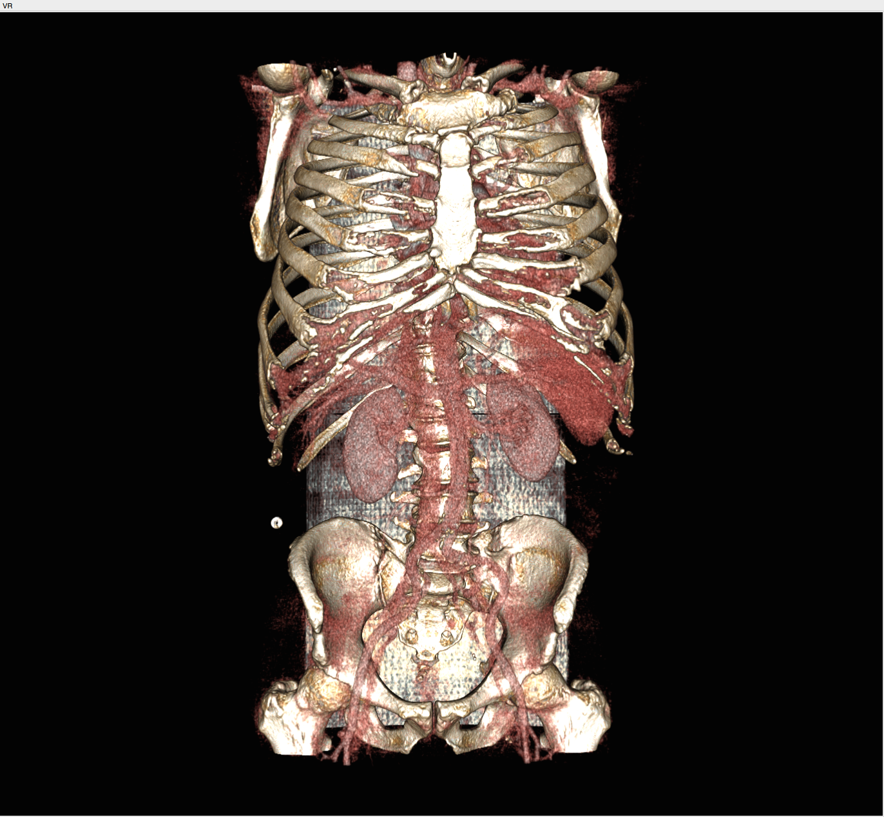
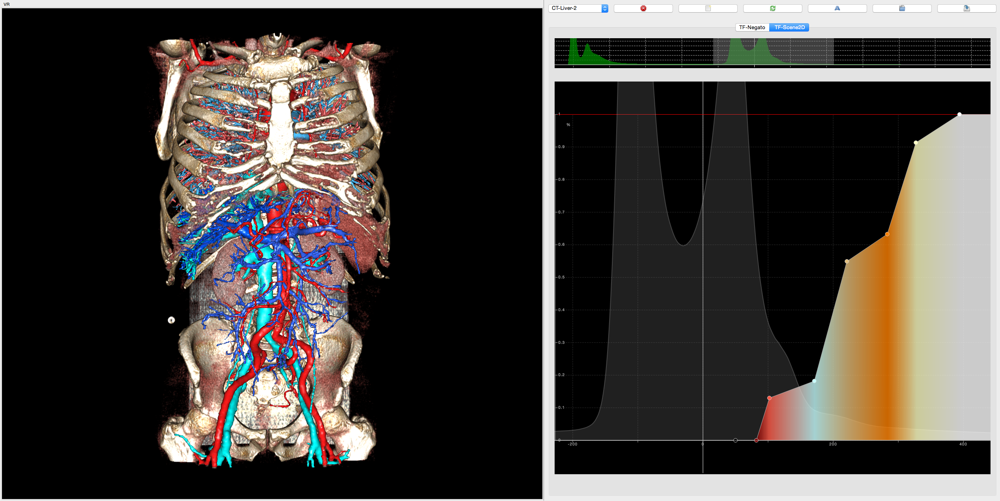

.. _fw4spl:

**********
fw4spl
**********

This repository contains the core libraries and bundles. It is hosted on GitHub_.

.. _GitHub: https://github.com/fw4spl-org/fw4spl

---------
Features
---------

 - Reader/Writer
    - DICOM reader/writer
        - PACS connection
        - 3D mesh segmentation reader/writer
        - DICOM filter for reader
    - VTK (images and meshes)
    - ITK
    - Atoms (our custom in-out data format)
 - Visualisation
    - 2D and 3D multi-planar reconstruction
    - volume rendering
    - 3D meshes

------------
Application
------------
**VRRender** is a medical image and segmentation viewer, containing all the previous features.

    Main VRRender view.

    MPR view of a medical 3D image.
    

    3D view of surfacic meshes.
    

        Volume rendering
    

    Volume rendering mixed with 3D surfacic meshes.

----------
Tutorials
----------

You can find some tutorials to explain fw4spl concept.

========================================  ================================================================
 Name                                     Concept
========================================  ================================================================
:ref:`Tuto01Basic<tuto01>`                Basic application
:ref:`Tuto02DataServiceBasic<tuto02>`     Simple image reading and rendering
Tuto02DataServiceBasicCtrl                Simple image reading and rendering without XML configuration
:ref:`Tuto03DataService<tuto03>`          Image reading and rendering with signal communication
:ref:`Tuto04SignalSlot<tuto04>`           Scene point of view synchronisation with signal communication
:ref:`Tuto05Mesher<tuto05>`               Simple mesher from a 3D image
:ref:`Tuto06Filter<tuto06>`               Simple image filter
:ref:`Tuto08GenericScene<tuto08>`         Scene with multi-object rendering
Tuto09MesherWithGenericScene              Scene with multi-object rendering and simple mesher
Tuto10MatrixTransformInGS                 Example of matrix transformation
Tuto11LaunchBasicConfig                   Example to launch XML config in application
Tuto12Picker                              Example of scene picker
Tuto13Scene2D                             Example using the ``scene2d`` bundle
Tuto14MeshGenerator                       Mesh features (point/cell color, normals, ...)
Tuto15Multithread                         Example of multi-threading using fw4spl worker
Tuto16MultithreadConsole                  Second example of multi-threading using fw4spl worker without XML configuration
TutoGui                                   Example of fw4spl gui feature (toolbar, menu, action)
TutoTrianConverterCtrl                    Utility converting .trian meshes to .vtk
TutoVectorField                           Example of vector field
========================================  ================================================================

----------
Examples
----------

==============================  ================================================================
 Name                           Concept
==============================  ================================================================
Ex01VolumeRendering              Volume rendering using transfer function
Ex02ImageMix                     Blend of two images
Ex03Registration                 Simple rigid image-mesh registration
Ex04ImagesRegistration           Simple rigid image-image registration
Ex05Activities                   Launch activities using a sequencer
Ex06Dump                         Memory managment
Ex07WheelWidget                  Wheel widget 
Ex08SParameters                  Parameters widget 
==============================  ================================================================

