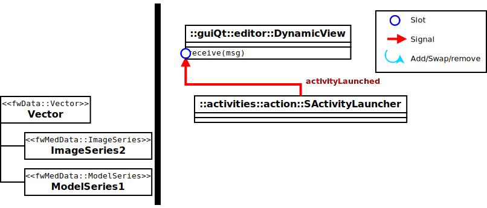
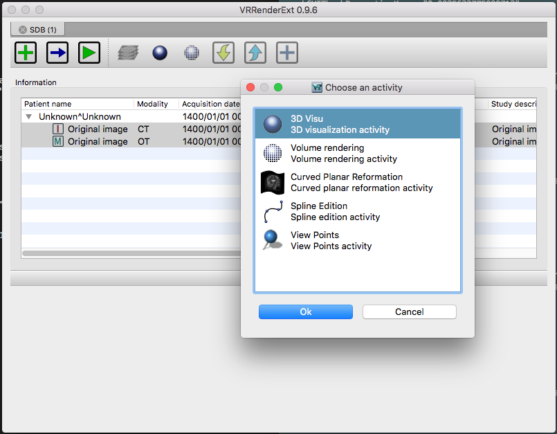

Activities
==========

An activity is defined by the extension ``::fwActivities::registry::Activities``. It is used to launch an 
:ref:`AppConfig<App-Config>` with the selected data, it will create a new data ``::fwMedData::ActivitySeries`` that 
inherits from a ``fwMedData::Series``.

The service ``::activities::action::SActivityLauncher`` allows to launch an activity. Its role is to create 
the specific Activity associated with the selected data.

This action should be followed by the service ``guiQt::editor::DynamicView`` : this service listens the action 
signals and launchs the activity in a new tab. 

* **::activities::action::SActivityLauncher** uses the selected data to generate the activity.
* **::guiQt::editor::DynamicView**  displays the activity in the application.
* **::fwData::Vector** contains the set of selected data .

Activity series
----------------

The ``::fwMedData::ActivitySeries`` has a ``::fwData::Composite`` that contains all the data required by the activity.

.. code-block:: cpp

    class FWMEDDATA_CLASS_API ActivitySeries : public ::fwMedData::Series
    {
    public:

        /// Constructor
        FWMEDDATA_API ActivitySeries();

        /// Destructor
        FWMEDDATA_API virtual ~ActivitySeries();

        /// Defines shallow copy
        FWMEDDATA_API void shallowCopy( const ::fwData::Object::csptr &_source );

        /// Defines deep copy
        FWMEDDATA_API void cachedDeepCopy( const ::fwData::Object::csptr &_source, DeepCopyCacheType &cache );

        /**
         * @brief Data container
         * @{ */
        ::fwData::Composite::sptr getData () const;
        void setData(const ::fwData::Composite::sptr & val);
        /**  @} */

        /**
         * @brief Activity configuration identifier
         * @{ */
        const std::string &getActivityConfigId () const;
        void setActivityConfigId (const std::string &val);
        /**  @} */

    protected:

        /// Activity configuration identifier
        ConfigIdType m_activityConfigId;

        /// Data container
        ::fwData::Composite::sptr m_data;
    };

Example
--------

.. code-block:: xml

    <extension implements="::fwActivities::registry::Activities">
       <id>myActivityId</id>
       <title>3D Visu</title>
       <desc>Activity description ...</desc>
       <icon>Bundles/media_0-1/icons/icon-3D.png</icon>
       <requirements>
           <requirement name="param1" type="::fwData::Image" /> <!-- defaults : minOccurs = 1, maxOccurs = 1-->
           <requirement name="param2" type="::fwData::Mesh" maxOccurs="3" container="composite">
               <key>Item1</key>
               <key>Item2</key>
               <key>Item3</key>
           </requirement>
           <requirement name="imageSeries" type="::fwMedData::ImageSeries" minOccurs="0" maxOccurs="2" />
           <requirement name="modelSeries" type="::fwMedData::ModelSeries" minOccurs="1" maxOccurs="1" />
           <!-- ...-->
       </requirements>
       <builder>::fwActivities::builder::ActivitySeries</builder>
       <validator>::fwActivities::validator::ImageProperties</validator><!-- pour fw4spl_0.9.2 -->
       <appConfig id="myAppConfigId">
           <parameters>
               <parameter replace="registeredImageUid" by="@values.param1" />
               <parameter replace="orientation" by="frontal" />
               <!-- ...-->
           </parameters>
       </appConfig>
    </extension>

The activity parameters are (in the following order):

id
*****
The activity unique identifier.

title
*******
The activity title that will be displayed on the tab.

desc
******
The description of the activity. It is displayed by the SActivityLauncher when several activity can be launched
with the selected data.

icon
*****
The path to the activity icon. It is displayed by the SActivityLauncher when several activity can be launched
with the selected data.

requirements
*************
The list of the data required to launch the activity. This data must be selected in the vector (``::fwData::Vector``).

requirement: 
    A required data.

    name:
        Key used to add the data in the activity Composite.
        
    type:
        The data type (ex: ``::fwMedData::ImageSeries``).
        
    minOccurs (optional, "1" by default):
        The minimum number of occurrences of this type of object in the vector.
        
    maxOccurs (optional, "1" by default):
        The maximum number of occurrences of this type of object in the vector.
        
    container (optional, "vector" or "composite", default: composite):
        Container used to contain the data if minOccurs or maxOccurs are not "1".
        If the container is "composite", you need to specify the "key" of each object in the composite.
        

builder
********
Implementation of the activity builder. The default builder is ``::fwActivities::builder::ActivitySeries`` :
it creates the ``::fwMedData::ActivitySeries`` and adds the required data in its composite with de defined key.

The builder ``::fwActivities::builder::ActivitySeriesInitData`` allows, in addition to what the default builder does, 
to create data when minOccurs == 0 and maxOccurs == 0.

validators (optional)
**********************
It defines the list of validators. If you need only one validator, you don't need the "validators" tag (only "validator").
    
validator (optional):
    It allows to validate if the selected required objects are correct for the activity. 
    
    For example, the validator ``::fwActivities::validator::ImageProperties`` checks that all the selected images 
    have the same size, spacing and origin.

appConfig
**********
It defines the AppConfig to launch and its parameters

id:
    Identifier of the AppConfig
    
parameters:
    List of the parameters required by the AppConfig
    
parameter:
    Defines a parameter
    
    replace: 
        Name of the parameter as defined in the AppConfig
    by: 
        Defines the string that will replace the parameter name. It should be a simple string (ex.
        frontal) or define a sesh@ path (ex. @values.myImage). The root object of the sesh@ path if the
        composite contained in the ActivitySeries.
