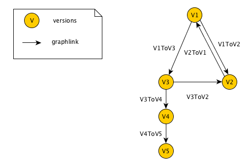
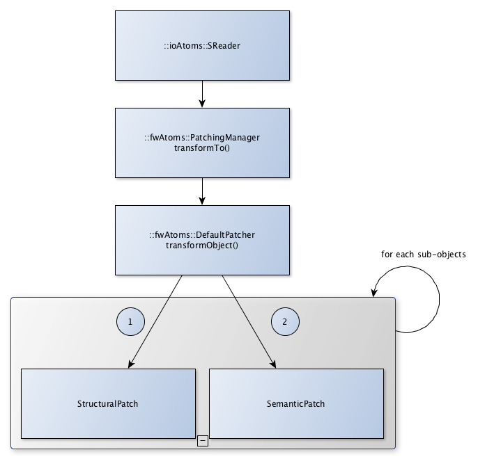

Data file migration
=======================

.. contents:: :depth: 2

Overview
-----------

The data migration system consists on converting the data to another version. It allows us to adapt any version of data to any version of software, and thus ensuring compatibility between data and software independently of their version.

Migration process is applied on two independent steps : 

 - In ``::ioAtoms::SReader`` while reading data files, previously serialized with ``fwAtoms``, right before converting said data to ``::fwData::Objects``. 

 - In ``::ioAtoms::SWriter`` after data is converted to ``fwAtoms::Base``.

Definitions
------------

Context
    It represents a complex chunk of data. For example, the `medical patient folder`_, the software preference file, etc. Hereafter we will consider a medical patient folder which is called **MedicalData**.

Structural patch
    This sort of patch affects only one object of the serialized data regardless of the context (ex: add or remove attribute, type, ...), see :ref:`StructuralPatch`.

Semantic patch
    This sort of patch is applied on a context to migrate to a given version without changing the data structure.
    (These patches are sometimes called contextual patches), see :ref:`SemanticPatch`.

Patcher
    A patcher defines the methods to parse the data and applies the structural and semantic patches, see :ref:`Patcher`.

.. _medical patient folder: SDM-SAD-PatientFolder.html

.. _DataVersion:

Data Version
-------------

After the conversion from ``::fwData::Object`` to ``::fwAtoms::Object``, each data is assigned a version number. Said number is defined in the camp serialization source files (see Serialization_). Each data structure modification causes an incrementation of the data version.

.. _Serialization: SDM-SAD-Serialization.html

Example of data declaration for introspection (used to convert to ``fwAtoms``):

.. code-block:: cpp

    #include <fwCamp/UserObject.hpp>

    fwCampImplementDataMacro((fwData)(ComplexClass))
    {
        builder
            .tag("object_version", "1") // data version
            .tag("lib_name", "fwData")
            .base< ::fwData::Object>()
            .property("myString" , &::fwData::ComplexClass::m_myString)
            .property("myFloat" , &::fwData::ComplexClass::m_myFloat)
            .property("mySimpleClass" , &::fwData::ComplexClass::m_mySimpleClass)
            ;
    }

.. _ContextVersion:

Context version
----------------

The context version must be incremented after a data version modification. 

.. note::
    
	- If several data versions are modified simultaneously, only one incrementation of the context version is necessary.
	- A single context version can contain data with different versions (see the example below).

The ``.versions`` file contains a detailed description of the context version, and the version of each data.

Example of ``V1.versions``:

.. code::

    {
        "context": "MedicalData",
        "version_name": "V1",
        "versions":
        {
            "::fwData::Array": "1",
            "::fwData::Boolean": "1",
            "::fwData::Image": "1",
            "::fwData::Integer": "1",
            "::fwData::Material": "1",
            "::fwData::Mesh": "1",
            "::fwData::Patient": "1",
        }
    }
    
Example of ``V2.versions``:

.. code::

    {
        "context": "MedicalData",
        "version_name": "V2",
        "versions":
        {
            "::fwData::Array": "1",
            "::fwData::Boolean": "1",
            "::fwData::Image": "2",
            "::fwData::Integer": "1",
            "::fwData::Material": "1",
            "::fwData::Mesh": "1",
            "::fwMedData::Patient": "1", 
        }
    }

.. _Migration:

Migration
----------

The migration is applied on a given context. It is described in the ``.graphlink`` file. It defines how to migrate from a context version to another. 

Example of ``V1ToV2.graphlink``:

.. code::

    {
        "context" : "MedicalData",
        "origin_version" : "V1",
        "target_version" : "V2",
        "patcher" : "DefaultPatcher",
        "links" : [
            {
                "::fwData::Patient" : "1",
                "::fwMedData::Patient" : "1"
            },
            {
                "::fwData::Image" : "1",
                "::fwData::Image" : "2"
            }
        ]
    }

The ``links`` tag represents the data version modifications, by doing so, associated patches can be applied.

.. warning::

    Two ``.versions`` files must be defined, one for each version (V1.versions and V2.versions).
    
.. note::
    
	It is not necessary to specify a simple data version incrementation on the ``links`` tag, the patching system establishes this information from the data version defined in the ``.versions`` files.
    

.. _Graph:
 
Graph
--------

The ``.graphlink`` and ``.versions`` files are parsed and the information is stored in the ``::fwAtoms::VersionsManager``. Each context defines a graph.

Example of graph:

The graph is used to find the migration path from an initial version to a target version.
In our example, it is possible to migrate from V1 to V5, the data is converted to V3, V4 then V5.
If several paths are possible, the shortest path is used.

.. _Structure:

Structure
-------------
    
The ``fwAtomsPatch`` library contains the base classes to perform the migration. 

PatchingManager
    This class provides the ``transformTo()`` method used to migrate the data. It uses the graph to apply 
    the patcher on each version.

patcher::IPatcher 
    Base class for patchers. 
    
patcher::DefaultPatcher
    Patcher used by default. It performs the data migration in two steps: first it applies the structural patches
    recursivly on each sub-object and then applies the semantic patches recursivly on each sub-object .

IPatch
    Base class for structural and semantic patches. It provides an ``apply()`` method that must be implemented in 
    sub-classes. 
    
ISemanticPatch
    Base class for semantic patches.

IStructuralPatch
    Base class for structural patches.

IStructuralCreator
    Base class for creators. It provides a ``create()`` method that must be implemented in sub-classes. 
    
SemanticPatchDB
    Singleton used to register all the semantic patches.
    
StructuralPatchDB
    Singleton used to register all the structural patches.
    
CreatorPatchDB
    Singleton used to register all the creator patches.
    
VersionsGraph
    Registers the migration graphs.
    
VersionsManager
    Singleton used to register all the version graph.

The ``fwStructuralPatch`` library contains the structural patches for ``fwData`` and ``fwMedData`` conversion.

The ``fwMDSemanticPatch`` library contains the semantic patches for ``fwData`` and ``fwMedData`` conversion in the ``MedicalData`` context.

The ``patchMedicalData`` bundle must be activated in your application to allow migration in ``MedicalData`` context. 
    
    
.. _StructuralPatch:

Structural patch
~~~~~~~~~~~~~~~~~

The structural patches are registered in the ``::fwAtomsPatch::StructuralPatchDB`` singleton. A structural patch provides a method ``apply`` that performs the structure conversion. The constructor defines the classname and versions of the origin and target objects as described in the ``.graphlink`` links section.

Example of structural patch to convert the ``fwData::Image`` from version 1 to 2. We add three attributes related to medical imaging: the number of components ``nb_components``, the window center ``window_center`` and the window width ``window_width``.

.. code-block:: cpp

    #include "fwStructuralPatch/fwData/Image/V1ToV2.hpp"
    
    #include <fwAtoms/Numeric.hpp>
    #include <fwAtoms/Numeric.hxx>
    
    namespace fwStructuralPatch
    {
    
    namespace fwData
    {
    
    namespace Image
    {
    
    V1ToV2::V1ToV2() : ::fwAtomsPatch::IStructuralPatch()
    {
        m_originClassname = "::fwData::Image";
        m_targetClassname = "::fwData::Image";
        m_originVersion   = "1";
        m_targetVersion   = "2";
    
    }
    
    // ----------------------------------------------------------------------------
    
    void V1ToV2::apply(
        const ::fwAtoms::Object::sptr& previous, // object in the origin version
        const ::fwAtoms::Object::sptr& current, // clone of the previous object to convert in the targer version
        ::fwAtomsPatch::IPatch::NewVersionsType& newVersions) // map < previous object, new object > association
    {
        // Check if the previous and current object version and classname correspond
        IStructuralPatch::apply(previous, current, newVersions);
    
        // Update object version
        this->updateVersion(current);
    
        // Create helper
        ::fwAtomsPatch::helper::Object helper(current);
    
        helper.addAttribute("nb_components", ::fwAtoms::Numeric::New(1));
        helper.addAttribute("window_center", ::fwAtoms::Numeric::New(50));
        helper.addAttribute("window_width", ::fwAtoms::Numeric::New(500));
    }
    
    } // namespace Image
    
    } // namespace fwData
    
    } // namespace fwStructuralPatch

.. _Creator:

Creator
~~~~~~~~

The creator provides a method ``create`` that allows to create a new object with the default attribute initialization. The creator is used in structural patches to create new sub-objects. 
Creators are registered in the ``::fwAtomsPatch::StructuralCreatorDB`` singleton.

Creators are useful for adding an attribute that is a non-null object.

Example of creator for the ``::fwMedData::Patient`` :

.. code-block:: cpp

    
    #include "fwStructuralPatch/creator/fwMedData/Patient1.hpp"
    
    #include <fwAtoms/String.hpp>
    
    #include <fwAtomsPatch/helper/Object.hpp>
    
    namespace fwStructuralPatch
    {
    namespace creator
    {
    namespace fwMedData
    {
    
    Patient1::Patient1()
    {
        m_classname = "::fwMedData::Patient";
        m_version   = "1";
    }
    
    // ----------------------------------------------------------------------------
    
    ::fwAtoms::Object::sptr Patient1::create()
    {
        // Create an empty ::fwAtoms::Object with the classname, version and ID informtation
        ::fwAtoms::Object::sptr patient = this->createObjBase(); 
        
        ::fwAtomsPatch::helper::Object helper(patient);
    
        helper.addAttribute("name", ::fwAtoms::String::New(""));
        helper.addAttribute("patient_id", ::fwAtoms::String::New(""));
        helper.addAttribute("birth_date", ::fwAtoms::String::New(""));
        helper.addAttribute("sex", ::fwAtoms::String::New(""));
    
        return patient;
    }
    
    } // namespace fwMedData
    } // namespace creator
    } // namespace fwStructuralPatch

.. _SemanticPatch:

Semantic patch
~~~~~~~~~~~~~~

The semantic patches are registered in the ``::fwAtomsPatch::SemanticPatchDB`` singleton.
The structural patch provides a method ``apply`` that performs the structure conversion. The constructor 
defines the origin classname, the origin version of the object, and the origin and the target context version as 
described in the ``.graphlink``.

The semantic patch is used when we need several objects to perform the object migration.

Example of semantic patch :

.. code-block:: cpp

    #include "fwMDSemanticPatch/V2/V3/fwData/Image.hpp"

    #include <fwAtoms/Object.hpp>
    #include <fwAtoms/Object.hxx>
    #include <fwAtoms/Numeric.hpp>
    #include <fwAtoms/Numeric.hxx>

    #include <fwAtomsPatch/helper/functions.hpp>

    namespace fwMDSemanticPatch
    {
    namespace V2
    {
    namespace V3
    {
    namespace fwData
    {

    Image::Image() : ::fwAtomsPatch::ISemanticPatch()
    {
        m_originClassname = "::fwData::Image";
        m_originVersion   = "1";
        this->addContext("MedicalData", "V2", "V3"); // Context version
    }

    // ----------------------------------------------------------------------------

    void Image::apply(
        const ::fwAtoms::Object::sptr& previous, // object in the origin version
        const ::fwAtoms::Object::sptr& current, // clone of the previous object to convert in the targer version
        ::fwAtomsPatch::IPatch::NewVersionsType& newVersions) // map < previous object, new object > association
    {
        // Check if the previous and current object version and classname correspond
        ISemanticPatch::apply(previous, current, newVersions);
        
        // Cleans object fields (also creates them if they are missing)
        ::fwAtomsPatch::helper::cleanFields( current );
        
        ::fwAtomsPatch::helper::Object helper( current );

        ::fwAtoms::Object::sptr array        = ::fwAtoms::Object::dynamicCast(previous->getAttribute("array"));
        ::fwAtoms::Numeric::sptr nbComponent =
                 ::fwAtoms::Numeric::dynamicCast(array->getAttribute("nb_of_components"));

        helper.replaceAttribute("nb_components", nbComponent->clone());
    }

    // ----------------------------------------------------------------------------

    } // namespace fwData
    } // namespace V3
    } // namespace V2
    } // namespace fwMDSemanticPatch

This patch changed the attribute ``nb_components`` in the image copied from array ``nb_of_components``.
   
   
.. _Patcher:
 
Patcher
~~~~~~~~

The patcher defines the methods to parse the data and applies the structural and semantic patches. It must inherit from ``fwAtomsPatch::patcher::IPatcher`` and implements the ``transformObject()`` method. 

We usually use the ``DefaultPatcher``. The conversion is processed in two steps: first it applies the structural patches recursivly on each sub-objects, then it applies the semantic patches recursively on each sub-objects.

Rules
~~~~~~

Rule 1
    A change in data (fwData, fwMedData, ...) involves the incrementation of the data version and the context version 
    and thus, the creation of structural and/or semantic patch.

Rule 2
    The creator patch creates the ``fwAtoms::Object`` representing the data object. The ``::fwAtoms::Object`` created 
    must be the same as the data created with a ``New()`` and converted to ``fwAtoms``.

Rule 3
    The *buffer object* (converted as BLOB in fwAtoms) is just reused (without copy) during the migration. If its
    structure is modified, you should clone the buffer before applying the patch. 

Rule 4
    If an object is contained in the ``fwAtoms::Object`` to migrate but is not present in the current context version 
    (in the ``.versions`` file), this object will be erased from the ``fwAtoms::Object``.

Usage
--------

If you have to modify data, you don't have to re-implement all the migration system, but there are steps to perform :

step 1
    Increment the data version in camp declaration (and update the declaration of the attribute if needed). See
    :ref:`DataVersion`.
    
step 2
    Increment the context version: create new ``.versions`` files (with the associated data version). See
    :ref:`ContextVersion`.
    
step 3
    Create the ``.graphlink`` file. See :ref:`graphlink<Migration>`.
    
step 4 (optional)
    Create the creator if you need to add a new non-null objet. See :ref:`Creator`.
    
step 5
    Create the structural patch. See :ref:`StructuralPatch`.
    
step 6 (optional)
    Create the semantic patch if you need other objects to update the current one. See :ref:`SemanticPatch`.
    
    
.. note::

    You can create migration patches from V1 to V3 without using the V1 to V2 and V2 to V3. 

 
