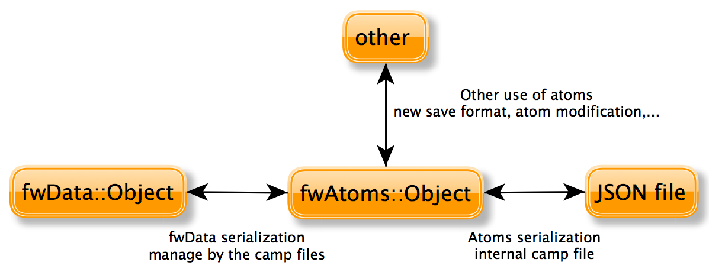

Overview
--------

Serialization is the process to save plain C++ structures from memory to hard
drive.  In fw4spl, ``fwAtoms`` library provides tools to serialize all data (and
especially Object that extend ``::fwData::Object``) to a JSON format [#]_.  Of
course, this process is also available for loading data from JSON format to
plain C++ structures.

.. [#] Introducing JSON. http://json.org/

To achieve this serialization, ``fwAtoms`` provides basic structures (which extend
``::fwAtoms::Base``) to manage better plain C++ structure evolution. Thus, there
are two main steps in the serialization process:

- Converting a ``::fwData::Object`` into a ``::fwAtoms::Object``
- Serializing a ``::fwAtoms::Base`` in a JSON format

Atom objects
------------

The basic structures provided by ``fwAtoms`` library are a set of restricted C++
type. All these structures extend ``::fwAtoms::Base`` and cover all basic types
and containers:

.. csv-table::
    :header: "type","brief"
    :widths: 1,3

    ::fwAtoms::Base,"Base class of all atoms"
    ::fwAtoms::String,"Atom to represent string types"
    ::fwAtoms::Numeric,"Atom to represent numeric types (floating number or integer)"
    ::fwAtoms::Boolean,"Atom to represent a boolean value"
    ::fwAtoms::Map,"Atom to represent an associative container (std::string to ::fwAtoms::Base)"
    ::fwAtoms::Sequence,"Atom to represent a sequence of object like vector or list"
    ::fwAtoms::Object,"Atom to represent a C++ object with attributes"
    ::fwAtoms::Blob,"Atom to represent binary information like buffers"

For instance, consider the following C++ class:

.. code:: cpp

    class SimpleClass
    {
        bool m_myBoolean;
    };

    class ComplexClass
    {
        std::string m_myString;
        float m_myFloat;
        SimpleClass* m_mySimpleClass;
    };

It's Atom equivalent is (simplified code):

.. code:: cpp

    fwAtoms::Object
    {
        metaInfos
        {
            "CLASSNAME_METAINFO" : "SimpleClass"
            "ID_METAINFO" : "<ID of the object>"
        }

        attributes
        {
            "myBoolean" : ::fwAtoms::Boolean
        }
    }

    fwAtoms::Object
    {
        metaInfos
        {
            "CLASSNAME_METAINFO" : "ComplexClass"
            "ID_METAINFO" ; "<ID of the object>"
        }

        attributes
        {
            "myString" : ::fwAtoms::String
            "myFloat" : ::fwAtoms::Numeric
            "mySimpleClass" : ::fwAtoms::Object("SimpleClass")
        }
    }

The main advantage of this representation is the ability to change easily the
form of a class.  In fact, all plain C++ objects are represented as
``Atoms::Object`` with a map of attributes.  Thus, adding, removing or changing
the content of an attribute is easy.  Moreover, because of these restricted
types, atom parsing is also made easier.  The main difficulty is how to convert
plain C++ object using this set of restricted types.

Convert a ``fwData::Object``
----------------------------

As explained earlier, all objects in fw4spl inherit from the ``::fwData::Object``
class.  To convert a C++ object in Atom, it must inherit from this class.  To
allow this conversion, some work must be done.

The first thing is to update the header file of the structure and add these lines :

.. code:: cpp

    // Before all namespace
    fwCampAutoDeclareDataMacro((<namespace elem>)
            (<namespace elem>)(<class name>), <method export macro>);

    // In the public class part
    fwCampMakeFriendDataMacro((<namespace elem>)
            (<namespace elem>)(<class name>));

These two functions allow the declaration of the class to the conversion process.

Next, the conversion systems must know the class information including
attributes, base class, library location and data version. This is achieved by
creating a class which defines these properties.

Example
~~~~~~~

This can be illustrated by taking the previous class and creating these two files:

Header file of the newly created class: ComplexClass.hpp

.. code:: cpp

    // Reference class

    fwCampAutoDeclareDataMacro((fwData)(ComplexClass), FWDATA_API);

    namespace fwData
    {
    class ComplexClass : public ::fwData::Object
    {
        fwCampMakeFriendDataMacro((fwData)(ComplexClass));

        std::string m_myString;
        float m_myFloat;
        ::fwData::SimpleClass* m_mySimpleClass;
    };
    }

Header file of serialization class :

.. code:: cpp

    // hpp binding file
    #include <fwCamp/macros.hpp>
    #include <fwData/ComplexClass.hpp>
    #include "fwDataCamp/config.hpp"

    fwCampDeclareAccessor((fwData)(ComplexClass), (fwData)(SimpleClass));

Source file of serialization class :

.. code:: cpp

    // cpp binding file
    // include previous cpp file

    #include <fwCamp/UserObject.hpp>

    fwCampImplementDataMacro((fwData)(ComplexClass))
    {
        builder
            .tag("object_version", "1")
            .tag("lib_name", "fwData")
            .base< ::fwData::Object>()
            .property("myString" , &::fwData::ComplexClass::m_myString)
            .property("myFloat" , &::fwData::ComplexClass::m_myFloat)
            .property("mySimpleClass" , &::fwData::ComplexClass::m_mySimpleClass)
            ;
    }

In a header file, the method fwCampDeclareAccessor is necessary when an object
has a pointer or a smart pointer to another object.

In a source file, fwCampImplementDataMacro declares the properties of the bound
object with an object called a builder: it provides several methods to
describe the object to bind.

.. csv-table::
    :header: "method","brief"
    :widths: 1,3

    "tag(key, value)","Register a tag in the atom meta information."
    "base<BaseClass>()","Identify the base class of the bound object"
    "property(arg1, arg2)","Set property of the object and how to access it"

Most of the work is completed when the header file of the relevant class has been updated and a binding class created.  The last step is to register the binding class in the conversion system using the following line in the library containing binding classes:

.. code:: cpp

    localDeclarefwDataComplexClass();

In fw4spl, data are located in ``fwData`` library whereas data binding classes are located in ``fwDataCamp`` library. The above line registering a binding class can be found in ``fwDataCamp`` autoload.hpp files.

Serialization file example
~~~~~~~~~~~~~~~~~~~~~~~~~~

For more information about serialization see:

.. csv-table::
    :header: "location", "brief"

    "Srclib/core/fwData/include/","fwData header files with serialization macros"
    "Srclib/core/fwDataCamp","Serialization description of all fw4spl data"
    "Srclib/core/fwDataCamp/include/fwDataCamp/autoload.hpp","Auto loading data bindings in the system"

``fwData::Object`` to ``fwAtoms::Object`` conversion
~~~~~~~~~~~~~~~~~~~~~~~~~~~~~~~~~~~~~~~~~~~~~~~~~~~~

The requirements to convert an ``fwData::Object`` into an ``fwAtoms::Object`` are in the
``fwAtomConversion`` library.

Two functions are necessary to achieve this conversion:

.. code:: cpp

     //Convert a fwData::Object into fwAtoms::Object
     SPTR(::fwAtoms::Object) convert( const SPTR(::fwData::Object) &data );

     //Convert a fwAtoms::Object into fwData::Object
     SPTR(::fwData::Object) convert( const SPTR(::fwAtoms::Object) &atom );

Serialize an Atoms object to JSON format
----------------------------------------

When a fw4spl data is converted into Atoms, it can be saved in JSON format. Both an Atom reader and Atom writer are available in the ``fwAtomsBoostIO``
fw4spl library: simply instantiate one of these classes with an Atom object
and call the read or write method.

To serialize atoms into JSON, a visitor pattern is used. An example can be
found in the ``fwAtomsBoostIO/Reader.cpp`` file.

Conclusion
----------

Accordingly, you have now the requirements to serialize data in the framework and a basic knowledge about the mechanism behind it. To conclude, this is a diagram of the serialization mechanism:

