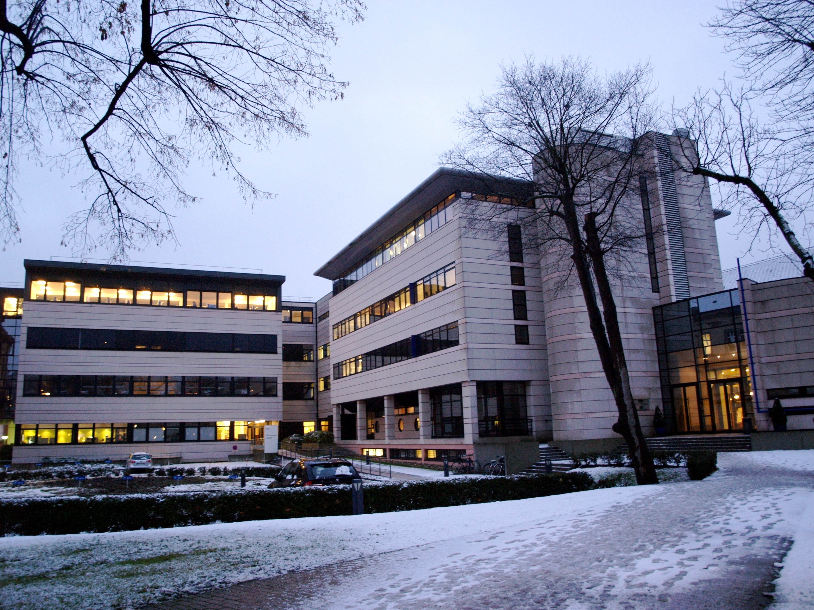
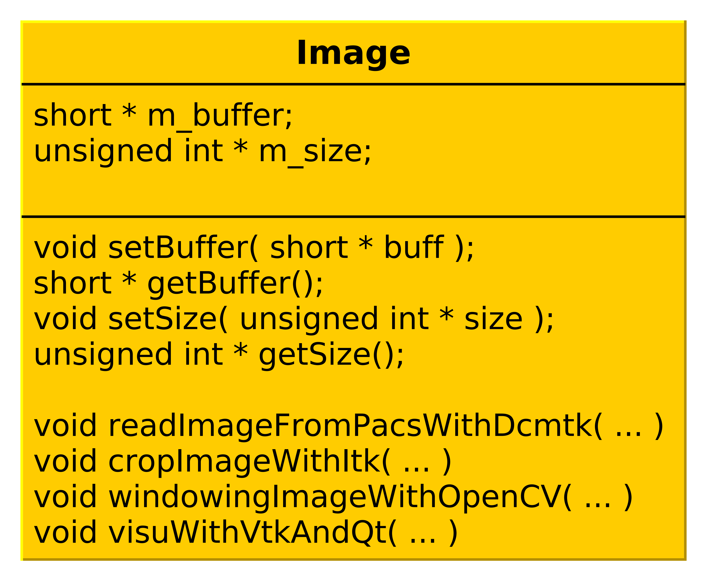

:title: FW4SPL
:data-transition-duration: 1250
:author: Flavien Bridault
:description: FW4SPL, a framework for applications based on medical imaging
:keywords: presentation
:css: css/presentation.css
:skip-help: true

----

:id: circle-no-background

|
|
|

FW4SPL, a framework for applications based on medical imaging. 
==================================================================

|

**Flavien Bridault**

*RMLL 2015 - Beauvais, Wednesday, 8th 2015*

----

:data-y: r1500
:data-rotate-z: 90
:class: text-small
           
IRCAD (Strasbourg, France)
==========================

           
- Institut de Recherche contre les Cancers de l'Appareil Digestif
- Created by Jacques Marescaux in 1994
- Training center - Research

.. note::
	- IRCAD is a research institute against digestive system cancers.
	- It is known worldwide especially because it is a training center, where 4000 surgeons/year attend courses on mini-invasive and laparoscopic surgery.
	- There are also two research and development teams. One about Robotics, and an another one about Computer Vision. FW4SPL is the framework developed by this team.
      
----
      
:class: text-small
     
IHU Strasbourg
=================

     
.. image:: images/ihu.jpg 
           :width: 80%
           
- Institut Hospitalier Universitaire
- Mini-invasive surgery guided by image

.. note::
	- IHU is located next to IRCAD.
	- It is a research center about mini-invasive surgery guided by image.
	- IHU also contributes to FW4SPL.
    
    
----

:data-y: r1500

Presentation purpose
==================================================================

- Why IRCAD R&D team has developed FW4SPL ?
- Explain the design
- Show the main features
- Help to start developing

----

FW4SPL meaning
===============

- FrameWork for Software Production Line
- Nickname: *F4S* -> *Forces* [fɔʁsjz]

.. note::
	- Also a disclaimer

----

:id: ircad-context

IRCAD context
=================

.. note::
    - At IRCAD, we make prototypes/PoC of software based on medical imaging
    - Our data is the patient
    - Historically we have worked on different steps of the image process
    
----

:data-x: r-300
:data-y: r-300
:data-scale: 0.4

.. raw:: html

       
Viewer/Segmentation

       <video width="800" height="600" controls>
          <source src="https://www.flickr.com/video_download.gne?id=23187333024" >
          Your browser does not support the video tag.
       </video>

----

:data-x: r-300
:data-y: r100
      

.. raw:: html

       
Planning

       <video width="800" height="600" controls>
          <source src="https://www.flickr.com/video_download.gne?id=24020554236" >
          Your browser does not support the video tag.
       </video>

.. note::
	Thanks to the 3D segmentation, we can help the surgeon to analyse a patient pathology. We worked on tools that help to plan the surgery. This activity has led to create a start-up called Visible Patient.

----

:data-y: r400

.. raw:: html

       
Simulation

       <video width="800" height="600" controls>
          <source src="https://www.flickr.com/video_download.gne?id=23419875623" >
          Your browser does not support the video tag.
       </video>
       
.. note::
	We also worked on medical simulators in laparoscopy. Laparoscopy is a way to perform a surgery with only small incisions in the abdomen. Surgeons interact with mechanical instruments and watch the organs through camera. Simulators help them to train without a . This activity has led to create a start-up called Digital Trainers.
       
----

:data-y: r100
:data-x: r300

.. raw:: html

       
Augmented reality

       <video width="800" height="600" controls loop>
          <source src="https://www.flickr.com/video_download.gne?id=23938494632" >
          Your browser does not support the video tag.
       </video>
       
.. note::
	Today we are focused on augmented reality. In laparoscopy, the surgeon has a very tight field of view. We superimpose informations on the video to help them during the surgery, for instance here, the location of the tumor on a liver.

----

:data-y: r-300
:data-scale: 1.2

----

:class: text-small
:data-y: r1500

IRCAD R&D team
=================

.. image:: images/team.jpg
           :width: 80%

- Researchers (3)
- Engineers (7)
- Phd. students (3)
- Trainees (6)
- Internships (4) 
   
.. note::
    - Around 20 people

----

Why a framework ?
==================

- Quick development, reuse source code
- Intensive use of open source libraries (boost, Qt, VTK, ITK,...) 
- Integrate trainees/students/researchers/partners code

.. note::
	- software/prototype - Windows, OSX, Linux, Android, IOs
	- reuse source code
	- we don't want people to work on different library versions, with different options,...
	- we need to integrate the different applications/fragmented code
    
----

FW4SPL characteristics
===========================

- Object/services design
- Component based (inspired by OSGi_)
- Applications built in XML
- Developed in C++
- Multi platforms (Windows, Linux, OSX, Android)
- Dependencies on many open source libraries
- Licensed under **LGPL**

.. _OSGi: http://www.osgi.org

.. note::
	- To match all these goals...
	- XML, not common to build applications
    
----

Important dates
=================

- 2004 : creation of FW4SPL project
- 2009 : FW4SPL became open-source (LGPL)
- 2010-2011 : PoC **Sofa** and **Kinect** (Altran-Est)
- 2013 : Creation of the FW4SPL board

.. note::
	- Sofa: biomechanical engine
	- Altran: proof that FW4SPL could be used outside IRCAD
	- Visible Patient was created in 2013 to commercialize the planning applications,...

----

:class: square-background
:data-x: r2000
:data-rotate-z: r90

Outline
==================================================================

- *Object/Service approach*
- Communication
- Component based approach
- Discussion
- Getting started

----

:data-x: r1500

What is the Object/Service approach ?
==================================================================

----

:data-x: r1500

Classic object-oriented approach
=================================

- an object (i.e. an image) is represented by a class.

----

:class: centered
:data-y: r270
:data-scale: 0.5

.. image:: images/Image.png
           :width: 80%

----

:data-scale: 1
:data-y: r250

- this class contains all functionalities working on the object (read, write, filter, visualize, ...)

----

:class: centered
:data-y: r250
:data-scale: 0.5

----

:data-scale: 1
:data-x: r1500

Limits of this approach
============================

- Too many methods in the class, hard to maintain 
- Many dependencies required even if you only need a single method.
- Collaborative work harder

Solution
***********
- Split data and functions

.. note::

    - Too many functions, if team continue to add functions
    - Many dependencies required (itk,vtk,qt,dcmtk,...) even if you just need  to crop an image
    - Everyone work on the same file

----

Service
============================

- Only one functionality (Read, Crop, Visualize...)
- Class of services (IReader, IOperator, IVisu)
- State pattern

.. note::
	- to this end, we use to concept of service
	- we can observe that for each process, we always have to repeat the same execution pattern, life cycle, configure, then initialize, update and stop
	- update can be repeated

----

:class: centered
:data-y: r400
:data-scale: 0.8

.. image:: images/state.png

	
.. note::
	- transitions, on ne peut pas passer de configure à stop
	- We need to store data into it

----

:class: centered
:data-scale: 1
:data-x: r1500
:data-y: r-200

*Service approach example*

.. image:: images/IService02.png
           :width: 120%

.. note::
	- Common interface 4 methods
	- sub-classes for each type
	- one service for each functionality
     
----

:data-scale: 0.15
:data-x: r-50
:data-y: r360

DcmtkReaderSrv
================

- configure() : verify if url is ok
- start() : do nothing
- update() : read the data ( equivalent to **readImageFromPacsWithDcmtk()** )
- stop() : do nothing

----

:data-x: r165

ItkCropOperatorSrv
===================
    
- configure() : verify if the cropping region is valid
- start() : do nothing
- update() : compute the cropping on image and set the new data (equivalent to **cropImageWithItk** )
- stop() : do nothing

----

:data-x: r360

VtkQtVisuSrv
===================
    
- configure() : verify if the screen support this size
- start() : initialize Qt frame and vtk pipeline and show the frame
- update() : check the buffer, if it has changed, refresh the vtk pipeline
- stop() : destroy vtk pipeline and uninitialize Qt frame.

.. note::
    
    - configure() : verify if the screen support this size
    - start() : initialize Qt frame and vtk pipeline and show the frame (image is not shown if image buffer is null )
    - update() : check if the buffer has be changed, if true, refresh the vtk pipeline to show negato
    - stop() : destroy vtk pipeline and uninitialize Qt frame.

----

:data-y: r600
:data-scale: 1

Application description in XML
======================================

- Objects and services classes are registered dynamically
- Instances are created by a factory
- Application launcher read a XML configuration file

----

:data-x: r1500
:class: text-small

XML configuration file
======================================

.. code:: xml

    <object type="::fwData::Image">

        <service uid="myFrame" impl="DefaultFrame" type="IFrame" >
            <gui>
                <frame>
                    <minSize width="800" height="600" />
                </frame>
            </gui>
            <registry>
                <view uid="myVisu" />
            </registry>
        </service>

        <service uid="myVisu" impl="vtkSimpleNegatoRenderer" type="IRender" />
        
        <service uid="myReader" impl="VtkImageReader" type="IReader" >
            <filename path="./TutoData/patient1.vtk"/>
        </service>

        <start uid="myFrame" />
        <start uid="myVisu"/>
        <start uid="myReader"/>

        <update uid="myReader"/>    <!-- Read the image on filesystem -->
        <update uid="myVisu"/>      <!-- Refresh the visu -->

    </object>
    
----

Problem
==============

And if we read a new image later ?
************************************

- We can no longer call **update()** of the visualization from the xml
- *How to automate the call ?*

----

:class: square-background
:data-y: r1500
:data-rotate-z: 90

Outline
==============================

- Object/Service approach
- *Communication*
- Component based approach
- Discussion
- Getting started

----

:data-y: r1500

Communication
===================

- *Signals/Slots* (inspired by Qt)
    - Data -> Service
    - Service <-> Service
- Slot call
    - synchronous
    - asynchronous

----

:class: centered

.. image:: images/sigslot.png
           :width: 100%
           :align: center
           
|
|
|
|
|
|

----

:class: text-small
:data-x: r-10
:data-y: r-150
:data-scale: 0.6

.. code:: c++

    void DcmtkReaderSrv::update()
    {
        // Load an image using dcmtk
        Dcmtk::Image img;
        ... 
        
        Image* img = this->getObject<Image>();
        
        // Convert dcmtk image data in our format
        img->createImage(img, size);
        
        // Emit the signal "modified"
        Signal* sig = img->signal("modified");
        sig->asyncEmit();
    }
      
----

:class: text-small
:data-x: r-40
:data-y: r350

.. code:: xml

    <object uid="imageUID" type="::fwData::Image">
        
        ...

        <service uid="myVisu" impl="vtkSimpleNegatoRenderer" type="IRender" />
        
        <service uid="myReader" impl="VtkImageReader" type="IReader" >
            <filename path="./TutoData/patient1.vtk"/>
        </service>
        
        <connect>
            <signal>imageUID/modified</signal>
            <slot>myVisu/update</slot>
        </connect>

        <start uid="myFrame" />
        <start uid="myVisu"/>
        <start uid="myReader"/>
            
    </object>
    
----

:class: square-background
:data-y: r1500
:data-rotate-z: 180

Outline
================================

- Object/Service approach
- Communication
- *Component based approach*
- Discussion
- Getting started

----

:data-x: r-1500

Component in FW4SPL
========================

- Also called *Bundle*
- Dynamic library, loaded on demand
- Group services, by theme and/or by dependency
- Examples: 
    - **ioVTK**: reading/writing image or mesh data from VTK formats
    - **uiImageQt**: Qt widgets to manipulate images

----

Component based approach
========================

Benefits
***********

- Code reuse without recompiling
- Improve external dependencies management (VTK, ITK, Qt,...)
- Easier support
- Easier collaborative work

Examples
***********

- Eclipse,...

.. note::
	- Code split
	- Reuse code in another application, without recompiling your program, even no link of your application against a library
	- Easier support EXAMPLE correction of bug
    
----

Content of a Bundle
========================

- Xml description file : **plugin.xml**
- Library binary ( .so, .dll, .dylib)
- Other shared resources ( icons, sounds, ... )

.. note::
    - When a Bundle is compiled
    - Xml description file ( plugin.xml ) to describe the content of the dynamic library

----

:class: text-small

Extract of plugin.xml (ioITK)
==============================

.. code:: xml

    <plugin id="ioITK" class="ioITK::Plugin">
        <library name="ioITK" />

        <requirement id="io" />
        <requirement id="gui" />

        <extension implements="::fwServices::registry::ServiceFactory">
            <type>::io::IReader</type>
            <service>::ioITK::InrImageReaderService</service>
            <object>::fwData::Image</object>
            <desc>Inrimage Reader (ITK/Ircad)</desc>
        </extension>

        <extension implements="::fwServices::registry::ServiceFactory">
            <type>::io::IWriter</type>
            <service>::ioITK::InrImageWriterService</service>
            <object>::fwData::Image</object>
            <desc>Inrimage Writer (ITK/Ircad)</desc>
        </extension>

        <extension implements="::fwServices::registry::ServiceFactory">
            <type>::io::IWriter</type>
            <service>::ioITK::JpgImageWriterService</service>
            <object>::fwData::Image</object>
            <desc>Jpeg Writer (ITK)</desc>
        </extension>
        ...
    </plugin>

.. note::
	- This shows how to register services in the factory
	- This helps to load bundles dynamically
	- Don't talk about extension points
    
----

Bundles in application
========================

*profile.xml*

- Input file for the launcher
- Describe which bundles to use

----

:data-y: r-320

:class: text-small

.. code::

	<profile name="TestApp" version="0.1.0">

		<activate id="dataReg" version="0-1" />

		<activate id="gui" version="0-1" />
		<activate id="guiQt" version="0-1" />

		<activate id="io" version="0-1" />
		<activate id="ioVTK" version="0-1" />

		<activate id="media" version="0-1" />

		<activate id="visu" version="0-1" />
		<activate id="visuVTK" version="0-1" />
		<activate id="visuVTKQt" version="0-1" />

		<activate id="TestApp" />
		<activate id="appXml" version="0-1" >
		    <param id="config" value="TestAppBase" />
		    <param id="parameters" value="TestAppBase" />
		</activate>

		<start id="visuVTK" />
		<start id="visuVTKQt" />
		<start id="guiQt" />
		<start id="appXml" />

	</profile>

----

:data-x: r-1500

Example : I/O Bundles
==============================

.. raw:: html

       <video width="800" height="600" controls>
          <source src="https://www.flickr.com/video_download.gne?id=23707070182" >
          Your browser does not support the video tag.
       </video>

.. note::
    - Switch GUI !!!
    
----

:class: square-background
:data-y: r-20500
:data-rotate-z: 270

Outline
==================================================================

- Object/Service approach
- Communication
- Component based approach
- *Discussion*
- Getting started

----

:data-y: r-1500

Design of a new application
============================

- Write a new xml configuration file (plugin.xml)
- Pick the bundles you need (profile.xml)
- Write new services
- Create new bundles/libraries
- Share common code in regular shared libraries (*.so,*.dll)

----

Discussion
================================

*Services and components*

**Cons**

- Think design differently
- Need to write a new class for each new functionality

**Pros**

- Far less coupling !
- No need for a public and private API

----

:class: square-background
:data-rotate-z: 90
:data-x: r1500

Outline
==================================================================

- Object/Service approach
- Communication
- Component based approach
- Discussion
- *Getting started*

----

:data-y: r1500

Online documentation
========================================

- Documentation `<http://fw4spl.readthedocs.org/>`_
- Developper blog `<http://fw4spl-org.github.io/fw4spl-blog/>`_ 

----

Downloading FW4SPL
==============================

- Github : `<https://github.com/fw4spl-org>`_
- BitBucket : `<https://bitbucket.org/fw4splorg>`_
- Do not use the obsolete googlecode page !!! `<https://code.google.com/p/fw4spl/>`_ 

.. note::
	- googlecode may still be in the search engine results 

----

Which version to use ?
=========================

Current stable version : 0.10.1
***********************************

Current development version : 0.10.2
**************************************
- Strongly advised for a new software (communication API is simpler)
- Temporarily we need patches repositories, only available on bitbucket

.. code:: bash

    hg qclone https://bitbucket.org/fw4splorg/fw4spl-patches

----

Repositories
================

========= ==========  ===============
Type      Sources     Dependencies
========= ==========  ===============
Main      fw4spl      fw4spl-deps
Extended  fw4spl-ext  fw4spl-ext-deps
AR        fw4spl-ar   fw4spl-ar-deps
========= ==========  ===============

Third-part libraries
*********************

- Build scripts (CMake ExternalProject_Add())

.. note::
	- dependencies = external libraries (examples)
	- before building fw4spl, you must build dependencies
	- extended : work in progress
 
----

Main repository *(fw4spl)*
===========================

- Basic data (Float, Integer, String, Image, Mesh,... )
- GUI (Qt)
- Data I/O (JSON, DICOM (gdcm), VTK, Inr)
- 2D rendering (Qt)
- 3D rendering (VTK)
- Around 15 tutorials

----

:data-x: r-320

.. raw:: html

       <video width="800" height="600" controls>
          <source src="https://www.flickr.com/video_download.gne?id=23732849331" >
          Your browser does not support the video tag.
       </video>
       
- Medical images viewer : **VR-Render**

----

:data-x: r-350

.. raw:: html

       <video width="800" height="600" controls>
          <source src="https://www.flickr.com/video_download.gne?id=23187154854" >
          Your browser does not support the video tag.
       </video>

----

:data-y: r1500

Extended repository *(fw4spl-ext)*
===================================

- DICOM (dcmtk)
- OpenIGTLink support

----

:data-x: r-300

.. raw:: html

       <video width="800" height="600" controls>
          <source src="https://www.flickr.com/video_download.gne?id=23519652480" >
          Your browser does not support the video tag.
       </video>
       
----

:data-y: r1500

Augmented reality repository *(fw4spl-ar)*
===========================================

- Video player (**QtMultimedia**): file, camera or network
- Tag-based video tracking (**Aruco**, **OpenCV**)
- *ARCalibration* : Camera calibration (mono, stereo)

----

:data-x: r-320

.. raw:: html

       <video width="800" height="600" controls>
          <source src="https://www.flickr.com/video_download.gne?id=23707101372" >
          Your browser does not support the video tag.
       </video>
       
- *DroidTracking* : Tag tracking on Android devices

----

:data-x: r-350

.. raw:: html

       <video width="800" height="600" controls>
          <source src="https://www.flickr.com/video_download.gne?id=23789374406" >
          Your browser does not support the video tag.
       </video>

----

:data-y: r1500

Debian Integration
===================

- Available on testing_
- Previous stable version 0.9.2
- Ready to use !

.. _testing: https://packages.debian.org/testing/science/fw4spl

----

:data-y: r1000

Stay tuned !!!
================

Coming in September 2015
**************************

- Ogre3D integration : *fw4spl-Ogre3d*
- Advanced rendering techniques
- Better performances

----

:data-x: r-350

.. raw:: html

       <video width="800" height="600" controls>
          <source src="https://www.flickr.com/video_download.gne?id=23732949151" >
          Your browser does not support the video tag.
       </video>
       
----

:class: centered
:data-y: r1000

Thank you !
=============

fw4spl at gmail.com

fbridault at ircad.fr

johan.moreau at ircad.fr

|
|

	Presentation made with Hovercraft_

.. _Hovercraft: https://github.com/regebro/hovercraft
