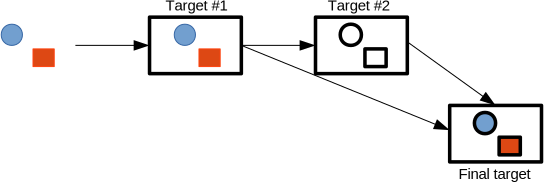
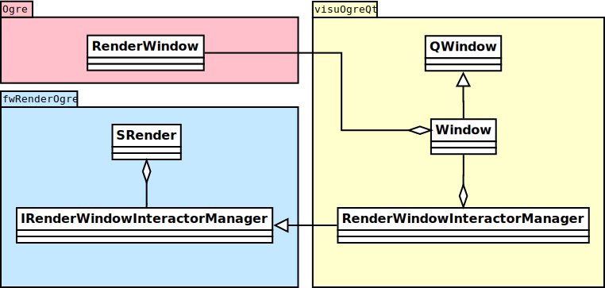
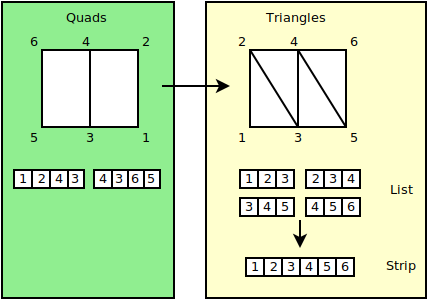
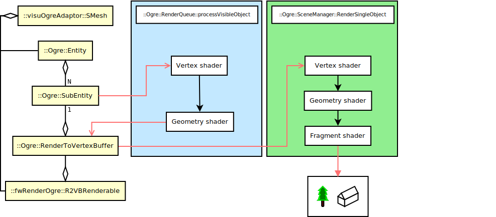

:title: FW4SPL
:data-transition-duration: 750
:author: Flavien Bridault
:description: Ogre 3D integration in FW4SPL
:keywords: presentation
:css: css/presentation.css
:skip-help: true

----

:id: circle-no-background

|
|
|
|

Ogre 3D in FW4SPL
==================================================================

**Flavien Bridault**

|

*Training - Strasbourg, 22nd January 2016*

----

:class: overview
:data-x: r2000
:data-scale: 1.0

Overview
==================================================================

- *Ogre 3D*
    - Architecture overview
    - Scripting
- Generic scene
    - Architecture
    - Basics
    - Adaptors
    - Transparency
- Perspectives
- Tutorials
    - Material
    - Compositors

----

:data-x: r0
:data-y: r2700
:data-rotate-z: 90

Ogre 3D
==================

History
**********

- Object-Oriented Graphics Rendering Engine
- Started in 2000, first release in 2005
- Latest stable 1.9 (2013), preview 2.1
- Used in free or commercial games
    - Ankh series (2005-2009)
    - TorchLight I (2009)
    - Zombie Driver (2009)
    - TorchLight II (2012-2015)
   
.. note::
	- Rendering Engine, not actually a game engine
	
----

:data-y: r1500
:class: text-medium

Ogre 3D
====================

Features
***********

- High-level abstractions 
- Cross-platform : Windows, Linux, MacOSX and Android
- Scene-graph
- Resource management (meshes, textures, material/shaders)
- Vertex animation (CPU and GPU)
- Material LOD
- Material scripting
- Multipass effects
- Progressive meshes (manual or auto)
- Shadows (image or object-based)
- Compositors
- Particles system
- Ribbon trails
- BSP/PVS, Octree, portals
    
.. note::
	- Texture == image

----

Ogre 3D
====================

Why ?
***********

- VTK  
    - is oriented towards visualization
    - is far from the hardware, very high-level abstraction
    - does not use cutting-edge OpenGL features
- Other 
    - Unreal, Unity
    - Irrlicht
    - G3D

----

:class: title

|
|
|

Architecture overview
==================================

----

Ogre 3D
==================

Architecture overview
***********************

.. image:: images/ogre-uml-overview.png
           :width: 100%

----

:data-y: r0
:data-x: r-100
:data-scale: .75

----

:data-x: r0
:data-y: r1700
:data-scale: 1

Ogre 3D
==================

::Ogre::Root
**************************

- Entry point in the Ogre system
- First to be created, last to be deleted
- Holds scene and resource managers
- Holds the render system
- Triggers the rendering of frames (continuous or on demand)

----

Ogre 3D
==================

::Ogre::RenderSystem
**************************

- Abstraction of the underlying 3D API (DirectX/OpenGL)
- Used to create render windows *::Ogre::RenderWindow*
- Instantiated dynamically by selecting a shared library
    - DirectX9
    - DirectX11
    - OpenGL
    - OpenGL3+

----

Ogre 3D
==================

::Ogre::SceneManager
**************************

- Organize the content of the 3D scene through a graph :
    - objects
    - cameras
    - lights
- Differents spatial structures used (BSP, PVS, etc...) according to the scene type
- Responsible of selecting the objects to be rendered each frame

----

Ogre 3D
==================

::Ogre::Entity
**************************

- Movable or static object in the scene
- Attached to a *::Ogre::SceneNode*
- Instantiation of a mesh in the 3D scene
- A mesh may have multiple materials : for each *::Ogre::SubMesh*, a *::Ogre::SubEntity* is created in the entity

----

Ogre 3D
==================

::Ogre::Material
**************************

- Render states
    - depth buffer test/write
    - culling/mode
    - blending equation
    - polygon fill mode (point, wireframe, solid)
    - ...
- Shader
    - vertex
    - hull
    - domain
    - geometry
    - fragment

----

Ogre 3D
==================

::Ogre::ResourceGroupManager
*****************************

- one for each resource type:
    - MeshManager
    - MaterialManager
    - TextureManager
    - CompositorManager
- allows to create/load/unload/destroy resources
- few direct interactions, called by other parts of the Ogre system

----

Ogre 3D
==================

::Ogre::ResourceGroupManager
*****************************

- Resources are created by name, looking through registered resource locations
    - **::Ogre::ResourceGroupManager::addResourceLocation()**
    - configured easily from *::Ogre::ConfigFile* (**.cfg**)

.. code::

    # resources.cfg

    [compositors]
    FileSystem=./Bundles/material_0-1/Media/compositors

    [materials]
    FileSystem=./Bundles/material_0-1/Media/materials/
    FileSystem=./Bundles/materialExt_0-1/Media/materials/
    
    [textures]
    FileSystem=./Bundles/material_0-1/Media/textures/

----

:class: title

|
|
|

Scripting
==================================

----

:class: text-small

Ogre 3D
==================

Materials
*****************************

.. code::

    // dummy.material

    vertex_program dummy_VP glsl
    {
        source dummy_VP.glsl
        default_params
        {
            param_named_auto u_worldViewProj worldviewproj_matrix
        }
    }

    fragment_program dummy_FP glsl
    {
        source dummy_FP.glsl
    }

    material dummy
    {
        technique
        {
            pass
            {
                cull_hardware none
                depth_write on
                polygon_mode wireframe

                vertex_program_ref dummy_VP
                {
                }

                fragment_program_ref dummy_FP
                {
                }
                            
                texture_unit
                {
                    texture image.png
                }
            }
        }
    }

----

Ogre 3D
==================

Materials
*****************************

- Materials are parsed from (**.material**) files from the registered resource locations 
- GLSL programs can be written in a **.material** file
    - be careful of the parsing order if you share programs accross multiple files
    - they can be put in **.program**, read before all **.material**
    
    
    
----

Ogre 3D
==================

Materials
*****************************

- Once parsed during initialization, easy to use:

.. code:: cpp
    
    entity->setMaterialName("dummy");
    
- Documentation: http://www.ogre3d.org/docs/manual/manual_14.html#Material-Scripts

----

Ogre 3D
==================

Compositors
*****************************

- Pipeline of successive rendering passes:
    - geometric pass
    - full screen pass

           
----

:data-x: r-900
:data-y: r0
:class: text-small
           
.. code::

    compositor Edges
    {
        technique
        {
            texture Scene target_width target_height PF_R8G8B8
            texture Edges target_width_scaled 0.5 target_target_height_scaled 0.5 PF_FLOAT16_R

            target Scene
            {
                input none
                pass clear
                {
                }
            
                pass render_scene
                {
                }
            }
            
            target Edges
            {
                input none

                pass render_quad
                {
                    material EdgeDetection
                    input 0 Scene
                }
            }

            target_output
            {
                input none

                pass render_quad
                {
                    material BlendEdges
                    input 0 Scene
                    input 1 Edges
                }
            }
        }
    }

----

:data-x: r0
:data-y: r1500

Ogre 3D
==================

Compositors
*****************************

- Compositors can be chained together:

.. code::

    // Next.compositor
    compositor Next
    {
        ...
        target dummy
        {
            input previous
            
            ...
        }
        ...
    }
    
.. code:: cpp

    // .cpp
    auto manager = ::Ogre::CompositorManager::getSingletonPtr();
    manager->addCompositor(viewport, "Edges");
    manager->addCompositor(viewport, "Next");
    manager->setCompositorEnabled(viewport, "Edges", true);
    manager->setCompositorEnabled(viewport, "Next", true);
    
----
    
Ogre 3D
==================

Compositors
*****************************

- render_scene passes can select a technique in the material
    
.. code::

    // .compositor
    target dummy
    {
        material_scheme tutuScheme

        pass render_scene
        {
        }
    }
    
----

:data-x: r-800
:data-y: r0

.. code::

    // .material
    material toto
    {
        technique
        {
            pass
            {
                vertex_program_ref default_VP
                {
                }

                fragment_program_ref default_FP
                {
                }
            }
        }

        technique tutu
        {
            scheme tutuScheme

            pass
            {
                vertex_program_ref tutu_VP
                {
                }

                fragment_program_ref tutu_FP
                {
                }
            }
        }
    }
    
----

:data-x: r0
:data-y: r1500

Ogre 3D
==================

Compositors
*****************************

- Documentation:

http://www.ogre3d.org/docs/manual/manual_29.html#Compositor-Scripts

- Limitation:
    - With the current v1.10, it is not possible to retrieve a depth buffer
    - Forced to use an extra floating-point buffer  
    - Supported with 2.0 and 2.1

----

:data-x: r0
:data-y: r2700
:data-rotate-z: r90
:class: overview

Overview
==================================================================

- Ogre 3D
    - Architecture overview
    - Scripting
- *Generic scene*
    - Architecture
    - Basics
    - Adaptors
    - Transparency
- Perspectives
- Tutorials
    - Material
    - Compositors
        
----

:data-x: r-2000
:data-y: r0
:data-rotate-z: r0
:class: title

|
|
|

Generic scene architecture
==================================================================

----

Generic scene
==================================================================

Architecture
*************

Same principle than our generic scene using VTK

- A **render** service, working on a ::fwData::Composite data, acts as a manager
- Sub-services named as *adaptors* work on the **keys** of the composite
- Adaptors are configured in XML or instantiated by the C++ code
- The manager listens to its composite, and supervises the starting and stopping of adaptors
- When an object is added/removed, the adaptor in the XML configuration is started/stopped

----

:data-x: r0
:data-y: r-900

.. code:: xml

    <service uid="genericSceneOgre" impl="::fwRenderOgre::SRender" autoConnect="yes">
        <scene>
            <background topColor="#DDDDDD" bottomColor="#43958D" topScale="0.7" bottomScale="1.0" />
            <renderer id="default" layer="1" />

            <adaptor id="cameraAdaptor" class="::visuOgreAdaptor::SCamera" objectId="cameraTF">
                <config renderer="default" />
            </adaptor>

            <adaptor id="meshAdaptor" class="::visuOgreAdaptor::SMesh" objectId="meshKey">
                <config renderer="default" transform="meshTF" />
            </adaptor>

            <adaptor id="transformAdaptor" class="::visuOgreAdaptor::STransform" objectId="transform">
                <config renderer="default" transform="meshTF"/>
            </adaptor>

        </scene>
    </service>

    <item key="cameraTF">
        <object uid="cameraTF" type="::fwData::TransformationMatrix3D" />
    </item>

    <item key="meshKey">
        <object uid="meshUid" type="::fwData::Mesh" />
    </item>

    <item key="transform">
        <object uid="transformUid" type="::fwData::TransformationMatrix3D" />
    </item>

----

:data-x: r-2000
:data-y: r0
:class: text-medium

Generic scene
==================================================================

Library design
****************

- the library *fwRenderOgre* contains the core
    - SRender service
    - Interactors
- the bundle *visu* allows to register SRender
- the bundle *visuOgreQt* contains the Qt widget and its interactions
- the bundle *visuOgreAdaptor* contains the core adaptors
    - SCamera
    - STransform
    - SMesh
    - SMaterial
    - SNegato
    - STexture
    - ...

----

:data-x: r-2000
:data-y: r0
:data-rotate-z: r0
:class: title

|
|
|

Basics
==================================================================

----

Generic scene
==================================================================

Windowing management
************************

           
----

:data-x: r0
:data-y: r1000

Generic scene
==================================================================

::visuOgreQt::Window
************************

- Create and manage the RenderWindow
    - There is some shi**** platform-specific code
- Responsible of triggering the rendering (on-demand)
- Receive mouse and keyboards interactions, forward them to the RenderWindowInteractorManager

----

:data-x: r0
:data-y: r-1000

----

:data-x: r0
:data-y: r-1000

Generic scene
==================================================================

::visuOgreQt::RenderWindowInteractorManager
********************************************

- Create ::visuOgreQt::Window and place it the GUI layout
- Manage communication with Qt and fw4spl slots 
    - *::fwRenderOgre::SRender*
    - *::visuOgreQt::Window*

----

:data-x: r0
:data-y: r1000

----

:data-x: r-1500
:data-y: r0

Generic scene
==================================================================

::fwRenderOgre::SRender
************************

- Contains and manages the adaptors
- Bridge between the adaptors and the widget
- With **makeCurrent()**, allows the adaptors to set the current OpenGL context
- With **requestRender()**, allows the adaptors to refresh the rendering

           
----

Generic scene
==================================================================

Layers
*************
    

.. image:: images/srender_layer.svg
           :width: 100%
           
----

:data-x: r0
:data-y: r1000

Generic scene
==================================================================

Layer
*************

- Allows to have multiple scenes in a window
- A scene is rendered individually in a render target (*::Ogre::Viewport*)
- The output is only a color texture, thus SRender composite them at the end

.. code:: xml

    <service uid="genericScene" impl="::fwRenderOgre::SRender" autoConnect="yes" >
        <scene>
            <renderer id="video" layer="1" />
            <renderer id="scene" layer="2" />
            ...
            
            <adaptor id="videoAdapter" class="::visuOgreAdaptor::SVideo" objectId="image">
                <config renderer="video" />
            </adaptor>
    
            <adaptor id="modelSeries" class="::visuOgreAdaptor::SModelSeries" objectId="model">
                <config renderer="scene" />
            </adaptor>

        </scene>
    </service>
    
----

:data-x: r0
:data-y: r-1000

----

:data-x: r0
:data-y: r-1000

Generic scene
==================================================================

Interactors
*************

- Two types :
    - How to pick objects : mesh, video
    - How to move the camera : trackball, fixed, negato2D
- Selected with *::visuOgreAdaptor::SInteractorStyle*

.. code:: xml

    <service uid="genericScene" impl="::fwRenderOgre::SRender" autoConnect="yes" >
        <scene>
            ...
            <adaptor id="adaptor" class="::visuOgreAdaptor::SInteractorStyle" objectId="self">
                <config renderer="default" style="Trackball" />
            </adaptor>
            ...
        </scene>
    </service>

----

:data-x: r0
:data-y: r1000

----

:data-x: r-1800
:data-y: r0

Generic scene
==================================================================

Compositors
*************

- *DefaultCompositor* handles the "core" compositors, like those related to transparency
 
- Each layer has a compositor chain managed by a *CompositorChainManager*, designed to receive custom compositors

.. code:: xml

    <service uid="genericScene" impl="::fwRenderOgre::SRender" autoConnect="yes" >
        <scene>
            <renderer id="video" layer="1" compositors="Laplace;ASCII;Bloom" />
            ...
        </scene>
    </service>

    
----

Generic scene
==================================================================

Background
*************

- Special layer #0, instantiated in SRender
- Can be filled with a gradient
    
.. code:: xml

    <service uid="genericScene" impl="::fwRenderOgre::SRender" autoConnect="yes" >
        <scene>
            <background topColor="#DDDDDD" bottomColor="#43958D" topScale="0.7" bottomScale="1.0" />
            ...
        </scene>
    </service>

----

Generic scene
==================================================================

Logging
*************

- The output log is redirected to the current working directory **Ogre.log**
- Very important for debugging materials and shaders

----

:data-x: r-2000

:class: title

|
|
|

Adaptors
==================================================================

----

Generic scene - Adaptors
==================================================================

STransform
*************

- Work on a *::fwData::TransformationMatrix3D*
- Wrap a *::Ogre::SceneNode*
- A parent transform can be specified, thus allowing to build a scene graph implicitly

.. code:: xml

    <adaptor id="meshAdaptor" class="::visuOgreAdaptor::SMesh" objectId="mesh">
        <config renderer="default" transform="meshTransform" />
    </adaptor>
                            
    <adaptor id="tfAdaptor" class="::visuOgreAdaptor::STransform" objectId="meshTF">
        <config renderer="default" transform="meshTransform" parentTransform="parentTransform" />
    </adaptor>

    <adaptor id="parentAdaptor" class="::visuOgreAdaptor::STransform" objectId="parentTF">
        <config renderer="default" transform="parentTransform" />
    </adaptor>
    
----

Generic scene - Adaptors
==================================================================

SMesh
*************

- Work on a *::fwData::Mesh*
- Instantiated in XML, but also automatically by *::visuOgreAdaptor::SModelSeries*
- Copy meshes data into *::Ogre::HardwareBuffer* as fast as possible
- Handle edges, triangles, quads or tetrahedrons primitives
- Handle only meshes with cells data (indices)
- Handle vertex normals, vertex texture coordinates, vertex colors and primitive colors

----

Generic scene - Adaptors
==================================================================

SMesh - Implementation details
*********************************

- Contains a *::Ogre::Mesh* and a *::Ogre::Entity*
- This means that mesh data is not shared between two adaptors on the same mesh (future work)
- By default, a *SMaterial* is created automatically but it can be specified in XML

.. code:: xml

    <adaptor id="meshAdaptor" class="::visuOgreAdaptor::SMesh" objectId="meshKey">
        <config renderer="default" transform="meshTransform" materialTemplate="Blue" />
    </adaptor>

    <adaptor id="meshAdaptor2" class="::visuOgreAdaptor::SMesh" objectId="meshKey">
        <config renderer="default" materialAdaptor="mtlAdaptorUID" />
    </adaptor>

    <adaptor id="mtlAdaptor" uid="mtlAdaptorUID" class="::visuOgreAdaptor::SMaterial" objectId="mtl">
        <config renderer="default" materialTemplate="Red" normalLength="1.0" />
    </adaptor>
    
----

Generic scene - Adaptors
==================================================================

SMesh - Render-to-Vertex Buffer
*********************************

- Quads or tetrahedrons are not native primitive types, they must be converted into triangles
- Per-primitive color is also not straightforward to implement, you need to duplicate points
- Doing this in software is expensive, especially if we need to do that every frame
- Take advantage of geometry shaders and Render-to-Vertex Buffer (GL_TRANSFORM_FEEDBACK)

----

Generic scene - Adaptors
==================================================================

SMesh - Render-to-Vertex Buffer
*********************************

Example: quads

           
----

Generic scene - Adaptors
==================================================================

SMesh - Render-to-Vertex Buffer
*********************************

- Give the GPU the raw quads list
- Let the geometry shader generate a strip of two triangles for each primitive

.. code:: glsl

    layout (lines_adjacency) in;
    layout (triangle_strip, max_vertices = 4) out;

    out vec3 oPos;

    void emit(int index)
    {
        oPos = gl_in[index].gl_Position.xyz;
        EmitVertex();
    }

    void main(void)
    {
        emit(0); emit(1); emit(3); emit(2);
        EndPrimitive();
    }

----

Generic scene - Adaptors
==================================================================

SMesh - Render-to-Vertex Buffer
*********************************

- Do we want to do that each time the object is rendered ?
    - The geometry shader cost is real, especially if we render the object several times
- So, we break the GPU pipeline after the geometry shader output, just before the rasterization
- The output is a vertex buffer that we can reuse when the object is rendered

----

Generic scene - Adaptors
==================================================================

SMesh - Render-to-Vertex Buffer
*********************************

- We use a special *R2VBRenderable* object, 
    - Contains a *::Ogre::RenderToVertexBuffer*, which takes a ::Ogre::SubEntity as input
- When it is updated, before rendering:
    1. Render the source data into a vertex buffer
    2. Put the result data in the render queue

|
|
|

----

:data-x: r100
:data-y: r-350
:class: centered
:data-scale: 0.5

----

:data-x: r-2000
:data-y: r0
:data-scale: 1

Generic scene - Adaptors
==================================================================

SMaterial
*************

- Work on a ::fwData::Material
- Instantiated by SMesh or configured by XML
- Wrap a *::Ogre::Material*

.. code:: xml

    <adaptor id="meshAd" class="::visuOgreAdaptor::SMesh" objectId="meshKey">
        <config renderer="default" materialAdaptor="mtlAdUID" />
    </adaptor>

    <adaptor id="mtlAd" uid="mtlAdUID" class="::visuOgreAdaptor::SMaterial" objectId="mtl">
        <config renderer="default" materialTemplate="Red" normalLength="1.0" />
    </adaptor>
    
----

Generic scene - Adaptors
==================================================================

SMaterial
*************

- *::Ogre::Material* is loaded 
    - from a script on disk
    - into the resource group **"materialsTemplate"**
- We create a copy of the template material, thus we can modify it without altering other objects which use this material

----

Generic scene - Adaptors
==================================================================

Material scripts registration
******************************

- Either put the material in the existing material Bundle
- Create a bundle and create a configuration file that indicates the resource locations : 

.. code::

    # resources.cfg
    [materials]
    FileSystem=./Bundles/myBundle_0-1/Media/materials/
    
- And register the configuration file :
    
.. code:: cpp

    // Plugin.cpp
    
    #define RESOURCES_PATH "./Bundles/myBundle_0-1/resources.cfg"
    
    void Plugin::start() throw(::fwRuntime::RuntimeException)
    {
        ::fwRenderOgre::Utils::addResourcesPath( RESOURCES_PATH );
    }
    
----

Generic scene - Adaptors
==================================================================

1/ Default material
************************

- *Default* is the main material
- It replaces the fixed function pipeline we had with VTK:
    - Flat/Gouraud/Diffuse shading
    - Point/WireFrame/Solid/Edge fill modes
    - Vertex color, diffuse texture
- Lots of combinations  !

----

Generic scene - Adaptors
==================================================================

2/ Default material
**********************************

- The GLSL code is shared as much as possible
- Use of **preprocessor_defines** in Ogre material program

.. code::

    // .material
    fragment_program Lighting_FP glsl
    {
        source Lighting.glsl
        preprocessor_defines LIGHTING_ENABLED=1,NUM_LIGHTS=10
    }

.. code:: glsl

    // Lighting.glsl
    ...
    #ifdef LIGHTING_ENABLED
    uniform vec3 u_lightDir[NUM_LIGHTS];
    #endif
    ...

----

Generic scene - Adaptors
==================================================================

3/ Default material
***********************

- We switch the vertex and fragment programs at runtime in *SMaterial::updateShadingMode()*
- Generation of the material programs definitions with a **Python** script using **Jinja** templating
    - **materials/genDefaultMaterial.py**
- Template: **materials/genTemplates/Default.program.tpl**
- Generated file: **materials/core/Default.program**
- Less error-prone

----

Generic scene - Adaptors
==================================================================

Negato
*************

- Two services SNegato2D and SNegato3D
- Work on a *::fwData::Image*
- Optional bilinear filtering supported
- Transfer function will be supported soon
- Interactions in 2D managed by a specific interactor *::fwRenderOgre::Negato2DInteractor*
- Use of textured planes ( *::fwRenderOgre::Plane* )

----

Generic scene - Adaptors
==================================================================

Negato - Implementation details
**************************************

- The 3D image is uploaded entirely to the GPU in a 3D texture
    - normalized unsigned integer texture format
    - cheap hardware bilinear interpolation (raw integer formats can't be filtered in OpenGL)
    - slower copy in CPU (conversion from signed to unsigned)
- Sampling is done in a fragment shader
    - conversion from unsigned to signed
    - interpolation and transfer function fetch (WIP)
    
----

Generic scene - Adaptors
==================================================================

Textures
*************

- Work on a *::fwData::Image*
- Wrap a ::Ogre::Texture
- Currently only used as a diffuse texture
- Static or dynamic texture
 
----

Generic scene - Adaptors
==================================================================

SShaderParameter
*****************

- Work on several data :
    - *::fwData::Integer*
    - *::fwData::Float*
    - *::fwData::Boolean*
    - *::fwData::Color*
    - *::fwData::PointList*
    - *::fwData::TransformationMatrix3D*
    - *::fwData::Vector*
- Upload the data as a program uniform    

----

:data-x: r-2000

:class: title

|
|
|

Transparency
==================================================================

----

Transparency
==================================================================

Order Independent Transparency
**********************************

- GPU hardware only supports alpha blending
    - Order dependent
- We support four different OIT techniques:
    - Depth Peeling (exact but slow)
    - Dual Depth Peeling (normally faster)
    - Weighted-Order Independent Transparency (fastest)
    - Hybrid Transparency (nice tradeoff)

----

Transparency
==================================================================

Implementation
**********************************

- Use of compositors with lots of passes
    - Example: one compositor pass for each peel in the Depth Peeling algorithm
- The scene is rendered several times
    - Specific code for the transparency
    - Common code for the lighting 
- Technique schemes are used to select the appropriate code
    - The material must implement **all** the schemes to support all the OIT techniques !
    - Techniques are automatically generated thanks to *::fwRenderOgre::compositor::MaterialMgrListener*

----

Transparency
==================================================================

Extensibility
**********************************

- Define a technique called *depth* that will be used for depth-only passes, with a single a vertex program
- Define your fragment shader code in seperated **.glsl**, in a function called **vec4 getFragmentColor()**
    - The **main()** function will be defined by *Main_FP.glsl* which is replaced at runtime 

.. code::

    fragment_program CustomProgram_FP glsl
    {
        source CustomProgram_FP.glsl
    }

    fragment_program Default/CustomProgram_FP glsl
    {
        source Main_FP.glsl
        attach CustomProgram_FP
    }

----

:data-x: r0
:data-y: r-900

.. code::

    material custom
    {
        technique
        {
            pass
            {
                vertex_program_ref custom_VP
                {
                }

                fragment_program_ref Default/CustomProgram_FP
                {
                }
            }
        }

        technique depth
        {
            pass
            {
                vertex_program_ref customDepth_VP
                {
                }
            }
        }
    }

----

:data-x: r-2000
:data-y: r0

:class: title

|
|
|

Perspectives
==================================================================

----

Perspectives
==================================================================

- Unit testing
- Volume rendering
- SAO with transparency
- Better visualizations for Augmented Reality
- New adaptors
- Helper drawing class
- 3D Widgets
- Diffuse/specular shading
- Post Effects
- Ogre 2.0/2.1 ?
- ...

----

:data-x: r0
:data-y: r-2700
:data-rotate-z: r90
:class: overview

Overview
==================================================================

- Ogre 3D
    - Architecture overview
    - Scripting
- Generic scene
    - Architecture
    - Basics
    - Adaptors
    - Transparency
- Perspectives
- *Tutorials*
    - Material
    - Compositors

----

:data-x: r0
:data-y: r-2000
:data-rotate-z: r0

:class: title

|
|
|

Tutorials - Material
==================================================================

----

Tutorials
==================================================================

1/ Mesh
*********

1. Grab the application skeleton on **OwnCloud/PartageRD/ogre-training**
2. Add an ogre generic scene to display the liver mesh

.. raw:: html

       <video width="640" height="360" controls>
          <source src="../videos/ogre-training1.ogv">
          Your browser does not support the video tag.
       </video>

----

Tutorials
==================================================================

2/ Texture
***********

1. Modify the previous application to load the liver texture with a *::ioVTK::SImageReader*
2. Add a texture adaptor on the loaded image to map it on the liver mesh

.. raw:: html

       <video width="640" height="360" controls>
          <source src="../videos/ogre-training2.ogv">
          Your browser does not support the video tag.
       </video>
       
----

Tutorials
==================================================================

3/ New Material
***************

1. Create a bundle and register a material "toto"
    - Check registration with **Ogre.log**
2. Create the material with a vertex shader and a fragment shader
    - Vertex shader only transforms the points
    - Fragment shader lits pixels in green
    
- Tip to write the vertex shader:
    - *gl_Position* output is automatically defined **RenderSystems/GL3Plus/src/GLSL/OgreGLSLShader.cpp:232**
    
----

:class: text-small

Tutorials
==================================================================

3/ New Material
***************

.. code::

    //-----------------------------------------------

    vertex_program toto_VP glsl
    {
        source toto_VP.glsl
        default_params
        {
            param_named_auto u_worldViewProj worldviewproj_matrix
        }
    }

    //----------------------------------------------

    vertex_program toto_FP glsl
    {
        source toto_FP.glsl
    }

    //----------------------------------------------
    material toto
    {
        technique
        {
            pass
            {
                vertex_program_ref toto_VP
                {
                }

                fragment_program_ref toto_FP
                {
                }
            }
        }
    }

----

Tutorials
==================================================================

3/ New Material
***************

.. raw:: html

       <video width="800" height="450" controls>
          <source src="../videos/ogre-training3.ogv">
          Your browser does not support the video tag.
       </video>
       
----

Tutorials
==================================================================

4/ Material with a static texture
***********************************

- Modify the material to add a texture unit and bind the sampler uniform
- Modify the vertex and fragment programs to forward the texture coordinates
    - Possible vertex input attributes are: 
        - *position* ( or *vertex*), 
        - *normal*, 
        - *colour*,
        - *secondary_colour*,
        - *tangent*,
        - *binormal*,
        - *uv#* (up to 8), 
        - *blendIndices*, 
        - *blendWeights*
        
----
 
Tutorials
==================================================================

4/ Material with a static texture
***********************************

- Sample the texture in the fragment program

.. raw:: html

       <video width="640" height="360" controls>
          <source src="../videos/ogre-training4.ogv">
          Your browser does not support the video tag.
       </video>
       
----

Tutorials
==================================================================

5/ Material with diffuse lighting
***********************************

- Modify the material to grab the light direction uniform

http://www.ogre3d.org/docs/manual/manual_23.html#Using-Vertex_002fGeometry_002fFragment-Programs-in-a-Pass

- Add the normal vertex input attribute
- Multiply the pixel color with the dot product of the light direction and the fragment normal
- **Bonus:** lit backfaces as well

.. raw:: html

       <video width="640" height="360" controls>
          <source src="../videos/ogre-training5.ogv">
          Your browser does not support the video tag.
       </video>
       
----

Tutorials
==================================================================

6/ Material with user control
******************************

- Now the vertex shader waves points away along the normal
- The fragment shader waves the base color 
- Use the two types of uniform in Ogre to control the wave
    a. Automatic - use one of the time uniforms
    b. User-defined - use *SShaderParameter* adaptor

http://www.ogre3d.org/docs/manual/manual_23.html#Using-Vertex_002fGeometry_002fFragment-Programs-in-a-Pass

----

Tutorials
==================================================================

6/ Material with user control
******************************

.. raw:: html

       <video width="640" height="360" controls>
          <source src="../videos/ogre-training6-1.ogv">
          Your browser does not support the video tag.
       </video>
       
       <video width="640" height="360" controls>
          <source src="../videos/ogre-training6-2.ogv">
          Your browser does not support the video tag.
       </video>

----

Tutorials
==================================================================

7/ Rendering passes
******************************

- Add a new pass in the material to render the liver a second time
    - Multiplied over the previous pass, with a different color
    - At a different location

----

:class: title

|
|
|

Tutorials - Compositors
==================================================================

----

Tutorials
==================================================================

1/ Blur
***********

1. Create a compositor
    - Don't forget to put it in a registered location !
2. Apply a 5x5 Gaussian filter on the source image
    - Sample the image with a texel offset [-5;5]
    - Take into account the size of the image (**viewport_width**, **viewport_height**)
    - Don't filter the texture image
3. Enlarge your blur !
    - "Cheat" by applying a bilinear filter on the source image
    - Downscale the resolution (1/4) of the render target used to perform the blur
4. **Bonus:** enhance the performance of the blur by using two passes: horizontal then vertical

----

Tutorials
==================================================================

1/ Blur
***********

.. raw:: html

       <video width="800" height="450" controls>
          <source src="../videos/ogre-training7.ogv">
          Your browser does not support the video tag.
       </video>
       
----

Tutorials
==================================================================

2/ Depth of Field (non-optimal)
*********************************

- Use the model **sponza.vtk**
- Add a target in the compositor where you render the scene to compute a blur factor
- Add a new material technique that matches the scheme of this pass and compute the blur factor in the vertex shader, depending on the distance :

.. code::
    
    blurFactor = clamp(abs(-posWorldView.z - focalDistance) / focalRange, 0.0, 1.0);

- Add a last step in the compositor to modulate the blur according to the blur factor :

.. code::

    gl_FragColor = sharp + blurFactor * (blur - sharp);

- Add a slider to modify the focalDistance  
    
----

Tutorials
==================================================================

2/ Depth of Field (non-optimal)
*********************************

.. raw:: html

       <video width="800" height="450" controls>
          <source src="../videos/ogre-training8.ogv">
          Your browser does not support the video tag.
       </video>
       
----

:class: centered

That's all folks !
===================
|

fw4spl at gmail.com

fbridault at ircad.fr

|

	Presentation made with Hovercraft_

.. _Hovercraft: https://github.com/regebro/hovercraft
