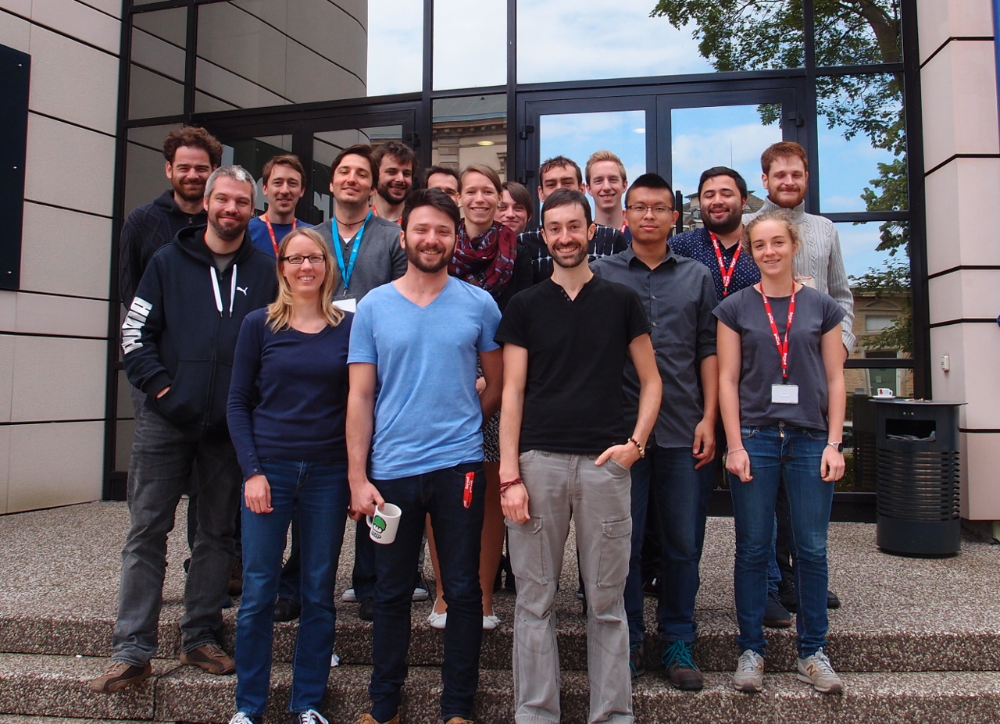
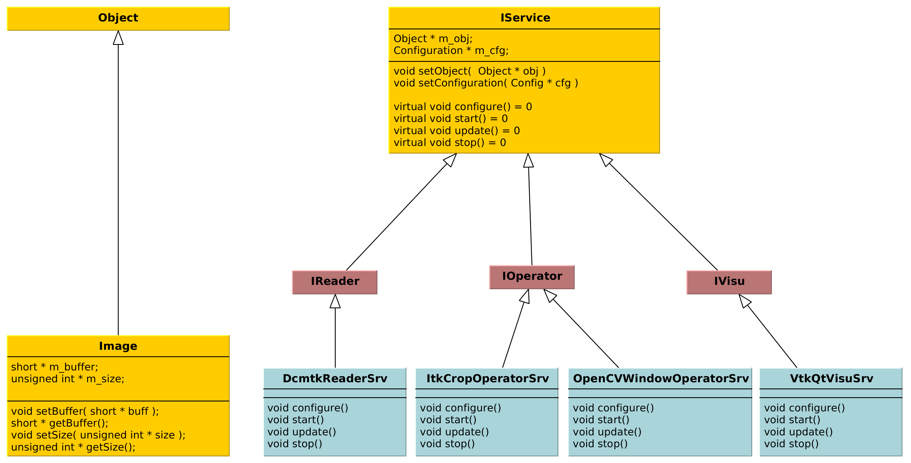

:title: FW4SPL
:data-transition-duration: 1250
:author: Flavien Bridault
:description: FW4SPL, a framework for applications based on medical imaging
:keywords: presentation
:css: css/presentation.css
:skip-help: true

----

:id: circle-no-background

|
|
|

FW4SPL, a framework for applications based on medical imaging. 
==================================================================

**Flavien Bridault**

*IRCAD - Strasbourg, 8th November 2016*

----

:class: square-background
:data-x: r2000
:data-scale: 1.0

|
|
|

Overall presentation
==================================================================

----

:data-x: r0
:data-y: r2700
:data-rotate-z: 90
:data-scale: 1.2
:class: text-small

IRCAD R&D team
=================

- Researchers (3)
- Engineers
    - 3DSurg (4+2)
    - Dosimap (2)
    - CONDOR (2)
    - ARES (1)
- Phd. students (1)
- Trainees (6)
- Internships (1)
   
`Trombinoscope link <https://intranet.ircad.fr/intranet/trombinoscope/>`_
   
----

FW4SPL meaning
===============

- FrameWork for Software Production Line
- Nickname: *F4S* -> *Forces* [fɔʁsjz]

.. note::
	- Also a disclaimer
	
----

:class: text-small
           
FW4SPL
==================

Why a framework ?
*******************
- Reuse source code
- Fast development
- Intensive use of open source libraries (boost, Qt, VTK, ITK,...) 
- Integrate trainees/students/researchers/partners code

Basics
***********
- Builds with CMake 
- Written in C++ (Python extension)
- Cross-platform : Windows, Linux, MacOSX and Android
- Started in 2004
- OpenSource since 2009 (LGPL license)

.. note::
	- software/prototype - Windows, OSX, Linux, Android, IOs
	- reuse source code
	- we don't want people to work on different library versions, with different options,...
	- we need to integrate the different applications/fragmented code
    
----

:class: text-small

Core features
======================

main repository :
*********************
- Basic data (Float, Integer, String, Image, Mesh,... )
- Application(HMI include) configuration available in xml
- 2D or 3D widgets synchronization
- Data serialization in xml/json/zip
- System/process memory managment (data dumping)
- 2D/3D generic scene (VTK/Qt)
- Embedded python
- Around 15 tutorials
- VRRender

others repositories :
*************************
- 4D synchronization - timeline
- 3D with Ogre, 2D with wxWidgets
- AR with OpenCV, Aruco, ARAM
- Network communication (openIGTLink and dicom with DCMTK)
- OpenNI, Sofa

----

:class: text-small

User features
======================

main repository :
*************************
- 2D Multi-Planar Reconstruction
- 3D meshes with optional 3D orthogonal MPR
- 3D volume rendering with editable and transfer func.
- Pre-defined pipeline of GPU shaders
- Measuring tool features and landmarks
- DICOM : CT and MRI, surface segmentation
- VTK : images and meshes (.vtk, .vti, .vtu)
- High-efficiency in-house data format
- Radiological and surgery data management

others repositories :
*************************
- MPR curved
- DICOM PACS and MIDAS communication
- Tracking, Calibration, Registration, ...
- Video player

----

:class: square-background
:data-rotate-z: r-90
:data-x: r2000
:data-y: r0

|
|
|

Design
==================================================================

----

:data-rotate-z: r0
:data-x: r1500

Classic object-oriented approach
=================================

- an object (i.e. an image) is represented by a class.

----

:class: centered
:data-x: r0
:data-y: r270
:data-scale: 0.5

.. image:: images/Image.png
           :width: 80%

----

:data-scale: 1
:data-y: r250

- this class contains all functionalities working on the object (read, write, filter, visualize, ...)

----

:class: centered
:data-y: r250
:data-scale: 0.5

.. image:: images/Image04.png
           :width: 80%

----

:data-scale: 1
:data-x: r0
:data-y: r1000

Limits of this approach
============================

- Too many methods in the class, hard to maintain 
- Many dependencies required even if you only need a single method.
- Collaborative work harder

Solution
***********
- Split data and functions

.. note::

    - Too many functions, if team continue to add functions
    - Many dependencies required (itk,vtk,qt,dcmtk,...) even if you just need  to crop an image
    - Everyone work on the same file

----

Object/Service
============================

- Only one functionality (Read, Crop, Visualize...)
- Class of services (IReader, IOperator, IVisu)
- State pattern

.. note::
	- to this end, we use to concept of service
	- we can observe that for each process, we always have to repeat the same execution pattern, life cycle, configure, then initialize, update and stop
	- update can be repeated

----

:class: centered
:data-x: r0
:data-y: r400
:data-scale: 0.8

.. image:: images/state.png

	
.. note::
	- transitions, on ne peut pas passer de configure à stop
	- We need to store data into it

----

:class: centered
:data-scale: 1
:data-x: r0
:data-y: r800

*Service approach example*

.. note::
	- Common interface 4 methods
	- sub-classes for each type
	- one service for each functionality
     
----

:data-scale: 0.15
:data-x: r-50
:data-y: r360

DcmtkReaderSrv
================

- configure() : verify if url is ok
- start() : do nothing
- update() : read the data ( equivalent to **readImageFromPacsWithDcmtk()** )
- stop() : do nothing

----

:data-x: r165
:data-y: r0

ItkCropOperatorSrv
===================
    
- configure() : verify if the cropping region is valid
- start() : do nothing
- update() : compute the cropping on image and set the new data (equivalent to **cropImageWithItk** )
- stop() : do nothing

----

:data-x: r360

VtkQtVisuSrv
===================
    
- configure() : verify if the screen support this size
- start() : initialize Qt frame and vtk pipeline and show the frame
- update() : check the buffer, if it has changed, refresh the vtk pipeline
- stop() : destroy vtk pipeline and uninitialize Qt frame.

.. note::
    
    - configure() : verify if the screen support this size
    - start() : initialize Qt frame and vtk pipeline and show the frame (image is not shown if image buffer is null )
    - update() : check if the buffer has be changed, if true, refresh the vtk pipeline to show negato
    - stop() : destroy vtk pipeline and uninitialize Qt frame.

----

:data-x: r0
:data-y: r600
:data-scale: 1

Application description in XML
======================================

- Objects and services classes are registered dynamically
- Instances are created by a factory
- Application launcher reads a XML configuration file

----

:data-x: r1500
:data-y: r0

:class: text-small

XML configuration file
======================================

.. code:: xml

    <object type="::fwData::Image">

        <service uid="myFrame" impl="DefaultFrame" type="IFrame" >
            <gui>
                <frame>
                    <minSize width="800" height="600" />
                </frame>
            </gui>
            <registry>
                <view uid="myVisu" />
            </registry>
        </service>

        <service uid="myVisu" impl="vtkSimpleNegatoRenderer" type="IRender" />
        
        <service uid="myReader" impl="VtkImageReader" type="IReader" >
            <filename path="./TutoData/patient1.vtk"/>
        </service>

        <start uid="myFrame" />
        <start uid="myVisu"/>
        <start uid="myReader"/>

        <update uid="myReader"/>    <!-- Read the image on filesystem -->
        <update uid="myVisu"/>      <!-- Refresh the visu -->

    </object>
    
----

Communication
===================

- *Signals/Slots* (inspired by Qt)
    - Data -> Service
    - Service <-> Service
- Slot call
    - synchronous
    - asynchronous

:class: centered

.. image:: images/sigslot.png
           :width: 100%
           :align: center
           
----

Component in FW4SPL
========================

- Also called *Bundle* (in OSGi)
- Dynamic library, loaded on demand
- Group services, by theme and/or by dependency
- Examples: **ioVTK**, **uiImageQt**

Content of a Bundle
*********************

- Xml description file : **plugin.xml**
- Library binary ( .so, .dll, .dylib)
- Other shared resources ( icons, sounds, ... )

.. note::
    - When a Bundle is compiled
    - Xml description file ( plugin.xml ) to describe the content of the dynamic library

----

:data-x: r0
:data-y: r1000

Component based approach
========================

Benefits
***********

- Code reuse without recompiling
- Improve external dependencies management (VTK, ITK, Qt,...)
- Easier support
- Easier collaborative work

Examples
***********

- Eclipse,...

.. note::
	- Code split
	- Reuse code in another application, without recompiling your program, even no link of your application against a library
	- Easier support EXAMPLE correction of bug
    
----

:data-x: r1500
:data-y: r0

Discussion
================================

*Services and components*

**Cons**

- Think design differently
- Need to write a new service for each new functionality

**Pros**

- Code reuse, and you pick only what you need
- Far less coupling !
- No need for a public and private API

----

:class: text-small
:data-rotate-z: 90
:data-x: r0
:data-y: r1500

Demonstration
===========================

.. raw:: html

       <video width="640" height="360" controls>
          <source src="https://www.flickr.com/video_download.gne?id=23732849331" >
          Your browser does not support the video tag.
       </video>
       
----

:data-y: r0
:data-x: r-500

.. raw:: html

       <video width="640" height="360" controls>
          <source src="https://www.flickr.com/video_download.gne?id=23187154854" >
          Your browser does not support the video tag.
       </video>

----

:data-x: r-450

.. raw:: html

       <video width="640" height="360" controls>
          <source src="https://www.flickr.com/video_download.gne?id=23519652480" >
          Your browser does not support the video tag.
       </video>
       
----

:data-x: r-450

.. raw:: html

       <video width="640" height="360" controls>
          <source src="https://www.flickr.com/video_download.gne?id=23707101372" >
          Your browser does not support the video tag.
       </video>
       
----

:data-x: r-450

.. raw:: html

       <video width="640" height="360" controls>
          <source src="https://www.flickr.com/video_download.gne?id=23789374406" >
          Your browser does not support the video tag.
       </video>

----

:data-x: r-450

.. raw:: html

       <video width="640" height="360" controls>
          <source src="https://www.flickr.com/video_download.gne?id=23815450025" >
          Your browser does not support the video tag.
       </video>

----

:class: square-background
:data-x: r1500
:data-y: r1000

|
|
|

Getting started
==================================================================

----

:class: text-small

:data-x: r0
:data-y: r1500

Getting started
==================================================================

Basics
******************

- GitHub `<http://fw4spl-org.github.io>`_
- Documentation `<http://fw4spl.readthedocs.org>`_
- Developper blog `<http://fw4spl-org.github.io/fw4spl-blog>`_ 
- #fw4spl on irc.freenode.net and `<http://fw4spl.slack.com>`_

Source
********************

- Github : `<https://github.com/fw4spl-org>`_
- BitBucket : `<https://bitbucket.org/fw4splorg>`_
- Do not use the obsolete googlecode page !!!
- Previous stable version : 0.10.1 (used in CE/FDA Application)
- Current stable version : 0.10.2 (used in CE/FDA Application)
- Current development version : 0.11.0 (Strongly advised for a new software)

Others
*************

- Repositories : fw4spl, fw4spl-ext, fw4spl-ar, fw4spl-ogre, ...
- Debian Integration (Older stable version 0.9.2)

----

.. image:: images/statF4S.png
           :width: 105%

----

:class: text-small
:data-x: r0
:data-y: r1500

Future
===========================

- **Installation improvement** (repository cloning, docker, ...)
- API and code **simplification**
- API **stabilisation** with roadmap (1.0 after 0.11/0.12 ?)
- Documentation improvement (Enhanced ISO13485 support)
- Enhanced C++11 support (C++14 ?)
- Enhanced Embedded python
- Enhanced unittests
- Support for **web** development
- User interface markup language
- New threading and GPU/GPGPU features

----

:class: centered
:data-y: r1500

Thank you !
=============

fw4spl at gmail.com

fbridault at ircad.fr

|
|

	Presentation made with Hovercraft_

.. _Hovercraft: https://github.com/regebro/hovercraft
