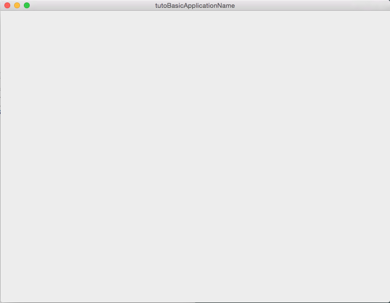

.. _tuto01:

***************************************
[*Tuto01Basic*] Create an application
***************************************

The first tutorial represents a basic application that launches a simple empty frame. It introduce the concept of XML 
application configuration and CMake generation.

    

Prerequisites
--------------

You should have properly install your fw4spl environment (see :ref:`Installation`).
 

Structure
----------

fw4spl is organized around four elements: the ``application``, the ``bundle``, the ``library`` and the ``utility``.

The ``applications`` contain the configuration of the ``bundles`` (and its services) to launch. The ``bundles`` contain
the cpp implementation of the services, it may also contain some application sub-configuration. The ``libraries`` 
contain the data implementationn and the code shared with several bundles. The ``utilities`` are simple executable using 
the ``libraries``.

In this example, we will only explain how to create a basic application with the existing bundles. Further Tutorials 
will explain how to use and create service and bundles.

A fw4spl application is organized around three main files : 
 * CMakeLists.txt
 * Properties.cmake
 * plugin.xml
 
CMakeLists.txt
~~~~~~~~~~~~~~~

The CMakeLists is parsed by CMake_. For the aplication it should contain the following lines : 

.. code-block:: cmake

    fwLoadProperties() 
    generic_install()

- ``fwLoadProperties`` allows to load Properties.cmake file and thus to build the application
- ``generic_install()`` allows to generate an installer for the application

.. _CMake: https://cmake.org

Properties.cmake
~~~~~~~~~~~~~~~~~

This file describes the project information and requirements (see :ref:`Properties.cmake`) :

.. code-block:: cmake

    set( NAME Tuto01Basic )
    set( VERSION 0.1 )
    set( TYPE APP ) 
    set( DEPENDENCIES  )
    set( REQUIREMENTS 
        dataReg # to load the data registry
        servicesReg # to load the service registry
        gui # to load gui
        guiQt # to load qt implementation of gui
        fwlauncher # executable to run the application
        appXml # to parse the application configuration
    )

    # Set the configuration to use : 'tutoBasicConfig'
    bundleParam(appXml PARAM_LIST config PARAM_VALUES tutoBasicConfig) 

    
This file contains the minimal requirements to launch an application with a Qt user interface.

.. note::

    The Properties.cmake file of the application is used by CMake_ to compile the application but also to generate the
    ``profile.xml``: the file used to launch the application. 
    

plugin.xml
~~~~~~~~~~~

This file is located in the ``rc/`` directory of the application. It contains the application configuration.
 
.. code-block:: xml

    <!-- Application name and version (the version is automatically replaced by CMake
         using the version defined in the Properties.cmake) -->
    <plugin id="Tuto01Basic" version="@DASH_VERSION@">

        <!-- The bundles in requirements are automatically started when this Application is launched. -->
        <requirement id="dataReg" />
        <requirement id="servicesReg" />
        <requirement id="guiQt" />

        <!-- Defines the App-config -->
        <extension implements="::fwServices::registry::AppConfig">
            <id>tutoBasicConfig</id><!-- identifier of the configuration -->
            <config>

                <!-- Frame service -->
                <service uid="myFrame" type="::gui::frame::SDefaultFrame">
                    <gui>
                        <frame>
                            <name>tutoBasicApplicationName</name>
                            <icon>@BUNDLE_PREFIX@/Tuto01Basic_0-1/tuto.ico</icon>
                            <minSize width="800" height="600" />
                        </frame>
                    </gui>
                </service>

                <start uid="myFrame" /><!-- start the frame service -->

            </config>
        </extension>
    </plugin>

``<requirement>`` lists the bundles that should be loaded before to launch the application: the bundle of registry or 
io service (see Requirements_)

The ``::fwServices::registry::AppConfig`` extension defines the configuration of an application: 

**id**: 
    The configuration identifier.
**config**: 
    Contains the list of objects and services used by the application. 
    
    For this tutorial, we have no object and only one service ``::gui::frame::SDefaultFrame``.
    
    There are others tags that will be described in the next tutorials.

.. _Requirements: https://rawgit.com/fw4spl-org/fw4spl-dox/dev/group__requirement.html

Run
----

To run the application, you must call the following line into the install or build directory:

.. code::

    bin/fwlauncher share/Tuto01Basic_0-1/profile.xml
