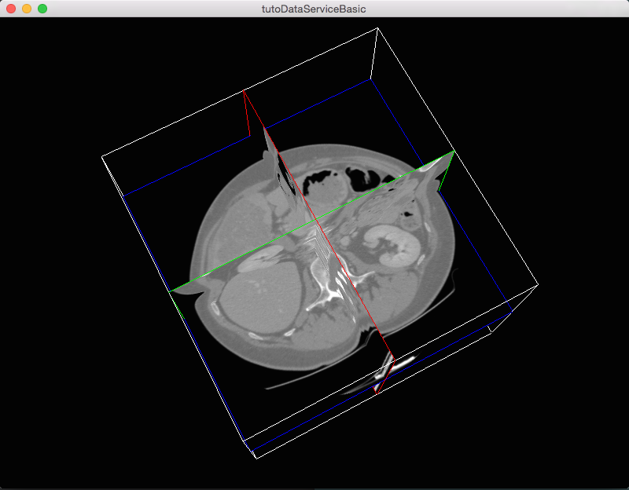

.. _tuto02ctrl:

********************************************************
[*Tuto02DataServiceBasicCtrl*] Tuto02 without XML
********************************************************

This tutorial shows the same application as :ref:`tuto02` but without using the XML configurations. The services declaration and configuration
are written in C++. When looking side-by-side you should see the benefit of using the XML descrption format.

Prerequisites
--------------

Before reading this tutorial, you should have seen :
 * :ref:`tuto01`
 * :ref:`tuto02`

Structure
----------

A C++ application does not need a configuration in the plugin.xml. Here we have chosen to write our application configuration in the first entry point we have in hand, that is, the ``initialize`` method of the 
``Plugin`` class.

Plugin
~~~~~~~~

The *Plugin* class contains the code that is run when a bundle is started (see :ref:`serviceBundle`). The declaration of
the services should be in the ``initialize()`` method.

In the header file ``Plugin.hpp``:

.. code-block:: cpp

    #pragma once

    #include "Tuto02DataServiceBasicCtrl/config.hpp"

    #include <fwData/Image.hpp>

    #include <fwRuntime/Plugin.hpp>

    #include <fwServices/IService.hpp>

    namespace Tuto02DataServiceBasicCtrl
    {

    /**
     * @brief   This class is started when the bundles is loaded.
     */
    class TUTO02DATASERVICEBASICCTRL_CLASS_API Plugin : public ::fwRuntime::Plugin
    {
    public:
        /// Constructor.
        TUTO02DATASERVICEBASICCTRL_API Plugin() noexcept;

        /// Destructor. Do nothing.
        TUTO02DATASERVICEBASICCTRL_API ~Plugin() noexcept;

        /// Overrides start method. .
        TUTO02DATASERVICEBASICCTRL_API void start();

        /// Overrides stop method. Do nothing
        TUTO02DATASERVICEBASICCTRL_API void stop() noexcept;

        TUTO02DATASERVICEBASICCTRL_API void initialize();

        TUTO02DATASERVICEBASICCTRL_API void uninitialize() noexcept;

    private:
        ::fwData::Image::sptr m_image;

        ::fwServices::IService::sptr m_frameSrv;
        ::fwServices::IService::sptr m_renderSrv;
        ::fwServices::IService::sptr m_readerSrv;
    };

    } // namespace Tuto02DataServiceBasicCtrl

In the source file ``Plugin.cpp``

.. code-block:: cpp

    #include "Tuto02DataServiceBasicCtrl/Plugin.hpp"

    #include <fwRuntime/operations.hpp>
    #include <fwRuntime/utils/GenericExecutableFactoryRegistrar.hpp>

    #include <fwServices/op/Add.hpp>
    #include <fwServices/registry/ObjectService.hpp>

    namespace Tuto02DataServiceBasicCtrl
    {

    static ::fwRuntime::utils::GenericExecutableFactoryRegistrar<Plugin> registrar("::Tuto02DataServiceBasicCtrl::Plugin");

    //------------------------------------------------------------------------------

    Plugin::Plugin() noexcept
    {
    }

    //------------------------------------------------------------------------------

    Plugin::~Plugin() noexcept
    {
    }

    //------------------------------------------------------------------------------

    void Plugin::start()
    {
    }

    //------------------------------------------------------------------------------

    void Plugin::initialize()
    {
        // create an empty image
        m_image = ::fwData::Image::New();

        // create and register the reader service
        m_readerSrv = ::fwServices::add("::ioVTK::SImageReader");
        m_readerSrv->registerInOut(m_image, "data"); // add the in-out image
        // create the reader configuration
        ::fwServices::IService::ConfigType readerCfg;
        readerCfg.put("file", "../../data/patient1.vtk");
        m_readerSrv->setConfiguration( readerCfg );
        m_readerSrv->configure();

        // create and register the render service
        m_renderSrv = ::fwServices::add("::vtkSimpleNegato::SRenderer");
        m_renderSrv->registerInput(m_image, "image"); // add the input image
        m_renderSrv->setID( "myRenderingTuto" ); // set an identifier
        m_renderSrv->configure();

        // create and register frame service
        m_frameSrv = ::fwServices::add("::gui::frame::SDefaultFrame");

        // create the frame configuration
        ::fwServices::IService::ConfigType frameConfig;
        frameConfig.put("gui.frame.name", "tutoDataServiceBasicCtrl");
        frameConfig.put("gui.frame.icon", "Tuto02DataServiceBasicCtrl-0.1/tuto.ico");
        frameConfig.put("gui.frame.minSize.<xmlattr>.width", "800");
        frameConfig.put("gui.frame.minSize.<xmlattr>.height", "600");
        // use the render identifier to display it in the frame
        frameConfig.put("registry.view.<xmlattr>.sid", "myRenderingTuto");

        m_frameSrv->setConfiguration( frameConfig );
        m_frameSrv->configure();

        // start the services
        m_frameSrv->start();
        m_readerSrv->start();
        m_renderSrv->start();

        // update the services
        m_readerSrv->update();
        m_renderSrv->update();
    }

    //------------------------------------------------------------------------------

    void Plugin::stop() noexcept
    {
    }

    //------------------------------------------------------------------------------

    void Plugin::uninitialize() noexcept
    {
        // stop the services
        m_renderSrv->stop();
        m_readerSrv->stop();
        m_frameSrv->stop();

        // unregister the services
        ::fwServices::OSR::unregisterService( m_readerSrv );
        ::fwServices::OSR::unregisterService( m_frameSrv );
        ::fwServices::OSR::unregisterService( m_renderSrv );
        m_image.reset();
    }

    //------------------------------------------------------------------------------

    } // namespace Tuto02DataServiceBasicCtrl

- ``::fwServices::add(...)`` create and register the service in the application.
- ``srv->registerInOut(..) or ``srv->registerInput(...)`` add the in-out or input data to the service
- ``::fwServices::OSR::unregisterService(...)`` unregister the service

Properties.cmake
~~~~~~~~~~~~~~~~~

This file describes the project information and requirements :

.. code-block:: cmake

    set( NAME Tuto02DataServiceBasicCtrl )
    set( VERSION 0.1 )
    set( TYPE APP )
    set( START ON ) # this app budle must be started when the application launches
    set( DEPENDENCIES # libraries needed to compile the C++ application
        fwData
        fwServices
        fwCom
        fwRuntime
    )
    set( REQUIREMENTS
        gui
        guiQt
        dataReg
        servicesReg
        visuVTK
        visuVTKQt
        ioData
        ioVTK
        vtkSimpleNegato
        fwlauncher
    )

.. note::

    The Properties.cmake file of the application is used by CMake to compile the application but also to generate the
    ``profile.xml``: the file used to launch the application.

Run
----

To run the application, you must call the following line in the install or build directory:

.. code::

    bin/fwlauncher share/Tuto02DataServiceBasicCtrl-0.1/profile.xml
