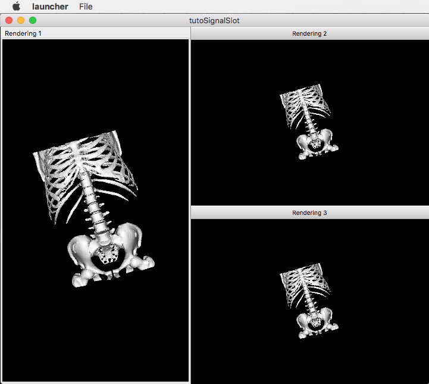

.. _tuto04:

***********************************************
[*Tuto04SignalSlot*] Signal-slot communication
***********************************************

The fourth tutorial explains the communication mechanism with signals and slots.

Prerequisites
===============

Before to read this tutorial, you should have seen :
 * :ref:`tuto03`
 * :ref:`SigSlot`

Structure
=============

Properties.cmake
------------------

This file describes the project information and requirements :

.. code-block:: cmake

    set( NAME Tuto04SignalSlot )
    set( VERSION 0.1 )
    set( TYPE APP )
    set( DEPENDENCIES  )
    set( REQUIREMENTS
        dataReg
        servicesReg
        gui
        guiQt
        io
        ioVTK
        uiIO
        visuVTKQt
        vtkSimpleMesh # contains a visualization service of mesh.
        launcher
        appXml
    )

    bundleParam(appXml PARAM_LIST config PARAM_VALUES tutoSignalSlotConfig)

.. note::

    The Properties.cmake file of the application is used by CMake to compile the application but also to generate the
    ``profile.xml``: the file used to launch the application.

plugin.xml
------------

This file is in the ``rc/`` directory of the application. It defines the services to run.

.. code-block:: xml

    <plugin id="Tuto04SignalSlot" version="@DASH_VERSION@">

        <requirement id="servicesReg" />

        <extension implements="::fwServices::registry::AppConfig">
            <id>tutoSignalSlotConfig</id>
            <config>

                <!-- The main data object is ::fwData::Mesh. -->
                <object uid="mesh" type="::fwData::Mesh" />

                <service uid="myFrame" type="::gui::frame::SDefaultFrame">
                    <gui>
                        <frame>
                            <name>tutoSignalSlot</name>
                            <icon>@BUNDLE_PREFIX@/Tuto04SignalSlot_0-1/tuto.ico</icon>
                            <minSize width="720" height="600" />
                        </frame>
                        <menuBar />
                    </gui>
                    <registry>
                        <menuBar sid="myMenuBar" start="yes" />
                        <view sid="myDefaultView" start="yes" />
                    </registry>
                </service>

                <service uid="myMenuBar" type="::gui::aspect::SDefaultMenuBar">
                    <gui>
                        <layout>
                            <menu name="File" />
                        </layout>
                    </gui>
                    <registry>
                        <menu sid="myMenuFile" start="yes" />
                    </registry>
                </service>

                <!--
                    Default view service:
                    This service defines the view layout. The type '::fwGui::CardinalLayoutManager' represents a main
                    central view and other views at the 'right', 'left', 'bottom' or 'top'.
                    Here the application contains a central view at the right.

                    Each <view> declared into the <layout> tag, must have its associated <view> into the <registry> tag.
                    A minimum window height and a width are given to the two non-central views.
                -->
                <service uid="myDefaultView" type="::gui::view::SDefaultView">
                    <gui>
                        <layout type="::fwGui::CardinalLayoutManager">
                            <view caption="Rendering 1" align="center" />
                            <view caption="Rendering 2" align="right" minWidth="400" minHeight="100" />
                            <view caption="Rendering 3" align="right" minWidth="400" minHeight="100" />
                        </layout>
                    </gui>
                    <registry>
                        <view sid="myRendering1" start="yes" />
                        <view sid="myRendering2" start="yes" />
                        <view sid="myRendering3" start="yes" />
                    </registry>
                </service>

                <service uid="myMenuFile" type="::gui::aspect::SDefaultMenu">
                    <gui>
                        <layout>
                            <menuItem name="Open file" shortcut="Ctrl+O" />
                            <separator />
                            <menuItem name="Quit" specialAction="QUIT" shortcut="Ctrl+Q" />
                        </layout>
                    </gui>
                    <registry>
                        <menuItem sid="actionOpenFile" start="yes" />
                        <menuItem sid="actionQuit" start="yes" />
                    </registry>
                </service>

                <service uid="actionOpenFile" type="::gui::action::SStarter">
                    <start uid="myReaderPathFile" />
                </service>

                <service uid="actionQuit" type="::gui::action::SQuit" />

                <service uid="myReaderPathFile" type="::uiIO::editor::SIOSelector">
                    <inout key="target" uid="mesh" />
                    <type mode="reader" /><!-- mode is optional (by default it is "reader") -->
                </service>

                <!--
                    Visualization services:
                    We have three rendering service representing a 3D scene displaying the loaded mesh. The scene are
                    shown in the windows defines in 'view' service.
                -->
                <service uid="myRendering1" type="::vtkSimpleMesh::SRenderer" autoConnect="yes" >
                    <in key="mesh" uid="mesh" />
                </service>
                <service uid="myRendering2" type="::vtkSimpleMesh::SRenderer" autoConnect="yes" >
                    <in key="mesh" uid="mesh" />
                </service>
                <service uid="myRendering3" type="::vtkSimpleMesh::SRenderer" autoConnect="yes" >
                    <in key="mesh" uid="mesh" />
                </service>

                <!--
                    Each 3D scene owns a 3D camera that can be moved by clicking in the scene.
                    - When the camera move, a signal 'camUpdated' is emitted with the new camera information (position,
                    focal, view up).
                    - To update the camera without clicking, you could call the slot 'updateCamPosition'

                    Here, we connect each rendering service signal 'camUpdated' to the others service slot
                    'updateCamPosition', so the cameras are synchronized in each scene.
                -->
                <connect>
                    <signal>myRendering1/camUpdated</signal>
                    <slot>myRendering2/updateCamPosition</slot>
                    <slot>myRendering3/updateCamPosition</slot>
                </connect>

                <connect>
                    <signal>myRendering2/camUpdated</signal>
                    <slot>myRendering1/updateCamPosition</slot>
                    <slot>myRendering3/updateCamPosition</slot>
                </connect>

                <connect>
                    <signal>myRendering3/camUpdated</signal>
                    <slot>myRendering2/updateCamPosition</slot>
                    <slot>myRendering1/updateCamPosition</slot>
                </connect>

                <start uid="myFrame" />

            </config>
        </extension>

    </plugin>
    

You can also group the signals and all the slots together.

.. code-block:: xml

    <connect>
        <signal>myRenderingTuto1/camUpdated</signal>
        <signal>myRenderingTuto2/camUpdated</signal>
        <signal>myRenderingTuto3/camUpdated</signal>
        
        <slot>myRenderingTuto1/updateCamPosition</slot>
        <slot>myRenderingTuto2/updateCamPosition</slot>
        <slot>myRenderingTuto3/updateCamPosition</slot>
    </proxy>
    
.. tip::
    You can remove a connection to see that a camera in the scene is no longer synchronized.

Signal and slot creation
=========================

*RendererService.hpp*
---------------------

.. code-block:: cpp

    class VTKSIMPLEMESH_CLASS_API RendererService : public fwRender::IRender
    {
    public:
        // .....
        
        typedef ::boost::shared_array< double > SharedArray;

        typedef ::fwCom::Signal< void (SharedArray, SharedArray, SharedArray) > CamUpdatedSignalType;

        // .....
        
        /// This method is call when the VTK camera position is modified. 
        /// It notifies the new camera position.
        void notifyCamPositionUpdated();
        
    private:
        
        /// Slot: receives new camera information (position, focal, viewUp). 
        /// Update camera with new information.
        void updateCamPosition(SharedArray positionValue,
                               SharedArray focalValue,
                               SharedArray viewUpValue);

        // ....
        
        /// Signal emitted when camera position is updated.
        CamUpdatedSignalType::sptr m_sigCamUpdated;
    }

*RendererService.cpp*
---------------------

.. code-block:: cpp

    RendererService::RendererService() throw()
    {
        m_sigCamUpdated = newSignal<CamUpdatedSignalType>("camUpdated");

        newSlot("updateCamPosition", &RendererService::updateCamPosition, this);
    }
    
    //-----------------------------------------------------------------------------

    void RendererService::updateCamPosition(SharedArray positionValue,
                                            SharedArray focalValue,
                                            SharedArray viewUpValue)
    {
        vtkCamera* camera = m_render->GetActiveCamera();

        // Update the vtk camera
        camera->SetPosition(positionValue.get());
        camera->SetFocalPoint(focalValue.get());
        camera->SetViewUp(viewUpValue.get());
        camera->SetClippingRange(0.1, 1000000);

        // Render the scene
        m_interactorManager->getInteractor()->Render();
    }
    

    //-----------------------------------------------------------------------------

    void RendererService::notifyCamPositionUpdated()
    {
        vtkCamera* camera = m_render->GetActiveCamera();

        SharedArray position = SharedArray(new double[3]);
        SharedArray focal    = SharedArray(new double[3]);
        SharedArray viewUp   = SharedArray(new double[3]);

        std::copy(camera->GetPosition(), camera->GetPosition()+3, position.get());
        std::copy(camera->GetFocalPoint(), camera->GetFocalPoint()+3, focal.get());
        std::copy(camera->GetViewUp(), camera->GetViewUp()+3, viewUp.get());

        {
            // The Blocker blocks the connection between the "camUpdated" signal and the 
            // "updateCamPosition" slot for this instance of service. 
            // The block is release at the end of the scope.
            ::fwCom::Connection::Blocker block(
                                m_sigCamUpdated->getConnection(m_this->slot("updateCamPosition")));
            
            // Asynchronous emit of "camUpdated" signal
            m_sigCamUpdated->asyncEmit (position, focal, viewUp);
        }
    }
    
    //-----------------------------------------------------------------------------

    // ......
    

Run
=========

To run the application, you must call the following line into the install or build directory:

.. code::

    bin/fwlauncher Bundles/Tuto04SignalSlot_0-1/profile.xml
