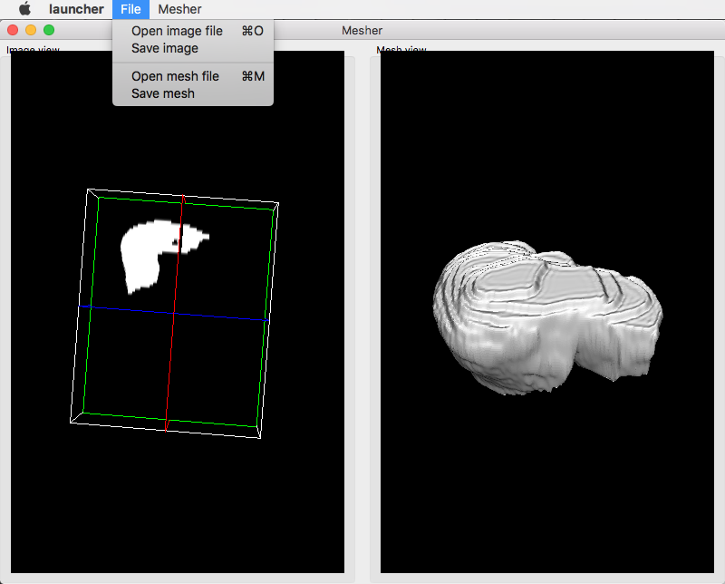

.. _tuto05:

**********************************************
[*Tuto05Mesher*] Create a mesh from an image
**********************************************

The fifth tutorial explains how to use several object in an application. 
This application provides an action to creates a mesh from an image.

Prerequisites
===============

Before to read this tutorial, you should have seen :
 * :ref:`tuto04`

Structure
=============

Composite
----------

A ``::fwData::Composite`` is an object that contains a map of ``fwData::Object`` associated to a key (``std::string``).

Using Composite in C++
~~~~~~~~~~~~~~~~~~~~~~~

.. code-block:: cpp
    
    // Create a Composite
    ::fwData::Composite::sptr composite = ::fwData::Composite::New();

    ::fwData::Image::sptr image = ::fwData::Image::New();
    ::fwData::Mesh::sptr mesh = ::fwData::Mesh::New();

    // Add an image and a mesh
    composite->getContainer()["myImage"] = image;
    composite->getContainer()["myMesh"] = mesh;

.. code-block:: cpp

    ::fwData::Composite::sptr composite = ::fwData::Composite::New();

    // Get the image
    ::fwData::Image::sptr image = composite->at< ::fwData::Image >("myImage");

    // Get the mesh
    ::fwData::Mesh::sptr mesh = composite->at< ::fwData::Mesh >("myMesh");

.. code-block:: cpp

    ::fwData::Composite::sptr composite = ::fwData::Composite::New();

    // Check if the image exists into the composite
    ::fwData::Composite::iterator iter = composite->find("myImage");
    if (iter != composite->end())
    {
        // Image is found
        ::fwData::Image::sptr image = ::fwData::Image::dynamicCast(iter->second);
    }
    else
    {
        // Image is not found
    }
    
Using Composite in XML
~~~~~~~~~~~~~~~~~~~~~~~

.. code-block:: xml

    <object type="::fwData::Composite">
    
        <!-- Composite services -->
    
        <item key="myImage">
            <object uid="myImageUID" type="::fwData::Image">
            
                <!-- Image services -->
            
            </object>
        </item>
        
        <item key="myMesh">
            <object uid="myMeshUID" type="::fwData::Mesh">
            
                <!-- Mesh services -->
            
            </object>
        </item>
        
    </object>

Properties.cmake
------------------

This file describes the project information and requirements :

.. code-block:: cmake

    set( NAME Tuto05Mesher )
    set( VERSION 0.1 )
    set( TYPE APP )
    set( DEPENDENCIES  )
    set( REQUIREMENTS
        dataReg
        servicesReg
        gui
        guiQt
        io
        ioVTK
        visuVTK
        visuVTKQt
        uiIO
        vtkSimpleNegato
        vtkSimpleMesh
        opVTKMesh # provides services to generate a mesh from an image.
        launcher
        appXml
    )

    bundleParam(appXml PARAM_LIST config PARAM_VALUES MesherConfig)

.. note::

    The Properties.cmake file of the application is used by CMake to compile the application but also to generate the
    ``profile.xml``: the file used to launch the application.

plugin.xml
------------

This file is in the ``rc/`` directory of the application. It defines the services to run.

.. code-block:: xml

    <plugin id="Tuto05Mesher" version="@DASH_VERSION@">

        <requirement id="servicesReg" />

        <extension implements="::fwServices::registry::AppConfig">
            <id>MesherConfig</id>
            <config>

                <!--
                    The main data object is ::fwData::Composite.
                    A Composite, can contains sub-objects associated to a key.
                -->
                <object type="::fwData::Composite">

                    <!-- Frame & View -->

                    <service uid="myFrame" impl="::gui::frame::SDefaultFrame">
                        <gui>
                            <frame>
                                <name>Mesher</name>
                                <icon>Bundles/Tuto05Mesher_0-1/tuto.ico</icon>
                                <minSize width="800" height="600" />
                            </frame>
                            <menuBar />
                        </gui>
                        <registry>
                            <menuBar sid="myMenuBar" start="yes" />
                            <view sid="myDefaultView" start="yes" />
                        </registry>
                    </service>

                    <!--
                        Default view service:
                        The type '::fwGui::LineLayoutManager' represents a layout where the view are aligned
                        horizontally or vertically (set orientation value 'horizontal' or 'vertical').
                        It is possible to add a 'proportion' attribute for the <view> to defined the proportion
                        used by the view compared to the others.
                    -->
                    <service uid="myDefaultView" impl="::gui::view::SDefaultView">
                        <gui>
                            <layout type="::fwGui::LineLayoutManager">
                                <orientation value="horizontal" />
                                <view caption="Image view" />
                                <view caption="Mesh view" />
                            </layout>
                        </gui>
                        <registry>
                            <view sid="RenderingImage" start="yes" />
                            <view sid="RenderingMesh" start="yes" />
                        </registry>
                    </service>

                    <!-- Menu Bar, Menus & Actions -->

                    <service uid="myMenuBar" impl="::gui::aspect::SDefaultMenuBar">
                        <gui>
                            <layout>
                                <menu name="File" />
                                <menu name="Mesher" />
                            </layout>
                        </gui>
                        <registry>
                            <menu sid="menuFile" start="yes" />
                            <menu sid="menuMesher" start="yes" />
                        </registry>
                    </service>

                    <service uid="menuFile" impl="::gui::aspect::SDefaultMenu">
                        <gui>
                            <layout>
                                <menuItem name="Open image file" shortcut="Ctrl+O" />
                                <menuItem name="Save image" />
                                <separator />
                                <menuItem name="Open mesh file" shortcut="Ctrl+M" />
                                <menuItem name="Save mesh" />
                                <separator />
                                <menuItem name="Quit" specialAction="QUIT" shortcut="Ctrl+Q" />
                            </layout>
                        </gui>
                        <registry>
                            <menuItem sid="actionOpenImageFile" start="yes" />
                            <menuItem sid="actionSaveImageFile" start="yes" />
                            <menuItem sid="actionOpenMeshFile" start="yes" />
                            <menuItem sid="actionSaveMeshFile" start="yes" />
                            <menuItem sid="actionQuit" start="yes" />
                        </registry>
                    </service>

                    <service uid="menuMesher" impl="::gui::aspect::SDefaultMenu">
                        <gui>
                            <layout>
                                <menuItem name="Compute Mesh (VTK)" />
                            </layout>
                        </gui>
                        <registry>
                            <menuItem sid="actionCreateVTKMesh" start="yes" />
                        </registry>
                    </service>

                    <service uid="actionQuit" impl="::gui::action::SQuit" />

                    <service uid="actionOpenImageFile" impl="::gui::action::SStarter">
                        <start uid="readerPathImageFile" />
                    </service>

                    <service uid="actionSaveImageFile" impl="::gui::action::SStarter">
                        <start uid="writerImageFile" />
                    </service>

                    <service uid="actionOpenMeshFile" impl="::gui::action::SStarter">
                        <start uid="readerPathMeshFile" />
                    </service>

                    <service uid="actionSaveMeshFile" impl="::gui::action::SStarter">
                        <start uid="writerMeshFile" />
                    </service>

                    <service uid="actionCreateVTKMesh" impl="::opVTKMesh::action::SMeshCreation">
                        <image uid="myImageUID" />
                        <mesh uid="myMeshUID" />
                        <percentReduction value="0" />
                    </service>

                    <!-- Image object associated to the key 'myImage' -->
                    <item key="myImage">
                        <object uid="myImageUID" type="::fwData::Image">

                            <!--
                                Services associated to the Image data :
                                Visualization, reading and writing service creation.
                            -->
                            <service uid="RenderingImage" impl="::vtkSimpleNegato::SRenderer" autoConnect="yes" />

                            <service uid="readerPathImageFile" impl="::uiIO::editor::SIOSelector">
                                <type mode="reader" />
                            </service>

                            <service uid="writerImageFile" impl="::uiIO::editor::SIOSelector">
                                <type mode="writer" />
                            </service>

                        </object>
                    </item>

                    <!-- Mesh object associated to the key 'myMesh' -->
                    <item key="myMesh">
                        <object uid="myMeshUID" type="::fwData::Mesh">

                            <!--
                                Services associated to the Mesh data :
                                Visualization, reading and writing service creation.
                            -->
                            <service uid="RenderingMesh" impl="::vtkSimpleMesh::SRenderer" autoConnect="yes" />

                            <service uid="readerPathMeshFile" impl="::uiIO::editor::SIOSelector">
                                <type mode="reader" />
                            </service>

                            <service uid="writerMeshFile" impl="::uiIO::editor::SIOSelector">
                                <type mode="writer" />
                            </service>

                        </object>
                    </item>

                    <start uid="myFrame" />

                </object>

            </config>
        </extension>
    </plugin>

Run
=========

To run the application, you must call the following line into the install or build directory:

.. code::

    bin/fwlauncher Bundles/Tuto05Mesher_0-1/profile.xml
