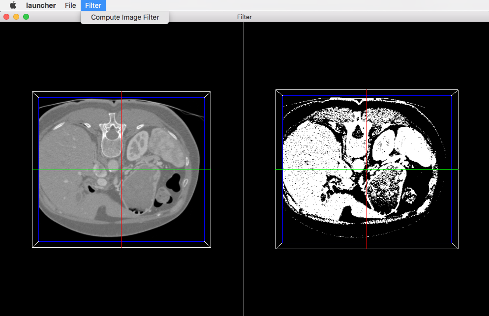

.. _tuto06:

********************************************
[*Tuto06Filter*] Apply a filter on an image
********************************************

This tutorial explains how to perform a filter on an image. Here, the filter applied on the image is a threshold.

Prerequisites
===============

Before to read this tutorial, you should have seen :
 * :ref:`tuto05`

Structure
=============

Properties.cmake
------------------

This file describes the project information and requirements :

.. code-block:: cmake

    set( NAME Tuto06Filter )
    set( VERSION 0.1 )
    set( TYPE APP )
    set( DEPENDENCIES  )
    set( REQUIREMENTS
        dataReg
        servicesReg
        gui
        guiQt
        io
        ioVTK
        uiIO
        visuVTKQt
        vtkSimpleNegato
        opImageFilter # bundle containing the action to performs a threshold
        launcher
        appXml
    )

    bundleParam(appXml PARAM_LIST config PARAM_VALUES FilterConfig)

.. note::

    The Properties.cmake file of the application is used by CMake to compile the application but also to generate the
    ``profile.xml``: the file used to launch the application.

plugin.xml
------------

This file is in the ``rc/`` directory of the application. It defines the services to run.

.. code-block:: xml

    <plugin id="Tuto06Filter" version="@DASH_VERSION@">

        <requirement id="dataReg" />
        <requirement id="servicesReg" />
        <requirement id="visuVTKQt" />

        <extension implements="::fwServices::registry::AppConfig">
            <id>FilterConfig</id>
            <config>

                <object uid="myImage1" type="::fwData::Image" />
                <object uid="myImage2" type="::fwData::Image" />

                <!-- Windows & Main Menu -->
                <service uid="myFrame" type="::gui::frame::SDefaultFrame">
                    <gui>
                        <frame>
                            <name>Filter</name>
                            <icon>@BUNDLE_PREFIX@/Tuto06Filter_0-1/tuto.ico</icon>
                            <minSize width="720" height="600" />
                        </frame>
                        <menuBar />
                    </gui>
                    <registry>
                        <menuBar sid="myMenuBar" start="yes" />
                        <view sid="myDefaultView" start="yes" />
                    </registry>
                </service>

                <service uid="myMenuBar" type="::gui::aspect::SDefaultMenuBar">
                    <gui>
                        <layout>
                            <menu name="File" />
                            <menu name="Filter" />
                        </layout>
                    </gui>
                    <registry>
                        <menu sid="menuFile" start="yes" />
                        <menu sid="menuFilter" start="yes" />
                    </registry>
                </service>

                <service uid="myDefaultView" type="::gui::view::SDefaultView">
                    <gui>
                        <layout type="::fwGui::CardinalLayoutManager">
                            <view align="center" />
                            <view align="right" minWidth="500" minHeight="100" />
                        </layout>
                    </gui>
                    <registry>
                        <view sid="RenderingImage1" start="yes" />
                        <view sid="RenderingImage2" start="yes" />
                    </registry>
                </service>

                <!-- Menus -->
                <service uid="menuFile" type="::gui::aspect::SDefaultMenu">
                    <gui>
                        <layout>
                            <menuItem name="Open image file" shortcut="Ctrl+O" />
                            <separator />
                            <menuItem name="Quit" specialAction="QUIT" shortcut="Ctrl+Q" />
                        </layout>
                    </gui>
                    <registry>
                        <menuItem sid="actionOpenImageFile" start="yes" />
                        <menuItem sid="actionQuit" start="yes" />
                    </registry>
                </service>

                <service uid="menuFilter" type="::gui::aspect::SDefaultMenu">
                    <gui>
                        <layout>
                            <menuItem name="Compute Image Filter" />
                        </layout>
                    </gui>
                    <registry>
                        <menuItem sid="actionImageFilter" start="yes" />
                    </registry>
                </service>

                <!-- Actions -->
                <service uid="actionQuit" type="::gui::action::SQuit" />
                <service uid="actionOpenImageFile" type="::gui::action::SStarter" >
                    <start uid="readerPathImageFile" />
                </service>

                <!--
                    Filter action:
                    This action applies a threshold filter. The source image is 'myImage1' and the
                    output image is 'myImage2'.
                    The two images are declared below.
                 -->
                <service uid="actionImageFilter" type="::opImageFilter::action::SThreshold">
                    <in key="source" uid="myImage1" />
                    <inout key="target" uid="myImage2" />
                </service>

                <!-- Image declaration: -->

                <!--
                    1st Image of the composite:
                    This is the source image for the filtering.
                -->
                <service uid="RenderingImage1" type="::vtkSimpleNegato::SRenderer" autoConnect="yes" >
                    <in key="image" uid="myImage1" />
                </service>

                <service uid="readerPathImageFile" type="::uiIO::editor::SIOSelector">
                    <inout key="target" uid="myImage1" />
                    <type mode="reader" />
                </service>

                <!--
                    2nd Image of the composite:
                    This is the output image for the filtering.
                -->
                <service uid="RenderingImage2" type="::vtkSimpleNegato::SRenderer" autoConnect="yes" >
                    <in key="image" uid="myImage2" />
                </service>

                <start uid="myFrame" />

            </config>
        </extension>
    </plugin>

Filter service
---------------

Here, the filter service is inherited from ::fwGui::IActionSrv but you can inherit from another type (like 
``::arServices::IOperator`` in fw4spl-ar repository).

For an action, the ``updating()`` method is called by the click on the button. This method retrieves the two images and 
applies the threshold algorithm.

The ``::fwData::Image`` contains a buffer for pixel values, it is stored as a ``void *`` to allows several types of 
pixel (uint8, int8, uint16, int16, double, float ...). To use image buffer, we need to cast it to the image pixel type. 
For that, we use the ``Dispatcher`` : it allows to invoke a template functor according to the image type.

.. code-block:: cpp

    void SThreshold::updating() throw ( ::fwTools::Failed )
    {
        SLM_TRACE_FUNC();

        // threshold value: the pixel with the value less than 50 will be set to 0, else the value is set to the maximum
        // value of the image pixel type.
        const double threshold = 50.0;

        ThresholdFilter::Parameter param; // filter parameters: threshold value, image source, image target

        // Get source image
        param.imageIn = this->getInput< ::fwData::Image >("source");
        SLM_ASSERT("'source' key not found", param.imageIn);

        // Get target image
        param.imageOut = this->getInOut< ::fwData::Image >("target");
        SLM_ASSERT("'target' key not found", param.imageOut);

        param.thresholdValue = threshold;

        /*
         * The dispatcher allows to apply the filter on any type of image.
         * It invokes the template functor ThresholdFilter using the image type.
         */
        ::fwTools::DynamicType type = param.imageIn->getPixelType(); // image type

        // Invoke filter functor
        ::fwTools::Dispatcher< ::fwTools::IntrinsicTypes, ThresholdFilter >::invoke( type, param );

        // Notify that the image target is modified
        auto sig = param.imageOut->signal< ::fwData::Object::ModifiedSignalType >(::fwData::Object::s_MODIFIED_SIG);
        {
            ::fwCom::Connection::Blocker block(sig->getConnection(m_slotUpdate));
            sig->asyncEmit();
        }
    }

The functor is a *structure* containing a *sub-structure* for the parameters (inputs and outputs) and a template
method ``operator(parameters)``. 

.. code-block:: cpp

    /**
     * Functor to apply a threshold filter.
     *
     * The pixel with the value less than the threshold value will be set to 0, else the value is set to the maximum
     * value of the image pixel type.
     *
     * The functor provides a template method operator(param) to apply the filter
     */
    struct ThresholdFilter
    {
        struct Parameter
        {
            double thresholdValue; ///< threshold value.
            ::fwData::Image::csptr imageIn; ///< image source
            ::fwData::Image::sptr imageOut; ///< image target: contains the result of the filter
        };

        /**
         * @brief Applies the filter
         * @tparam PIXELTYPE image pixel type (uint8, uint16, int8, int16, float, double, ....)
         */
        template<class PIXELTYPE>
        void operator()(Parameter &param)
        {
            const PIXELTYPE thresholdValue = static_cast<PIXELTYPE>(param.thresholdValue);
            ::fwData::Image::csptr imageIn = param.imageIn;
            ::fwData::Image::sptr imageOut = param.imageOut;
            SLM_ASSERT("Sorry, image must be 3D", imageIn->getNumberOfDimensions() == 3 );
            imageOut->copyInformation(imageIn); // Copy image size, type... without copying the buffer
            imageOut->allocate(); // Allocate the image buffer

            ::fwDataTools::helper::ImageGetter imageInHelper(imageIn); // helper used to access the image source buffer
            ::fwDataTools::helper::Image imageOutHelper(imageOut); // helper used to access the image target buffer

            // Get image buffers
            const PIXELTYPE* buffer1 = (PIXELTYPE*)imageInHelper.getBuffer();
            PIXELTYPE* buffer2       = (PIXELTYPE*)imageOutHelper.getBuffer();

            // Get number of pixels
            const size_t NbPixels = imageIn->getSize()[0] * imageIn->getSize()[1] * imageIn->getSize()[2];

            // Fill the target buffer considering the thresholding
            for( size_t i = 0; i<NbPixels; ++i, ++buffer1, ++buffer2 )
            {
                * buffer2 = ( *buffer1 < thresholdValue ) ? 0 : std::numeric_limits<PIXELTYPE>::max();
            }
        }
    };
    

Run
=========

To run the application, you must call the following line into the install or build directory:

.. code::

    bin/fwlauncher Bundles/Tuto06Filter_0-1/profile.xml
