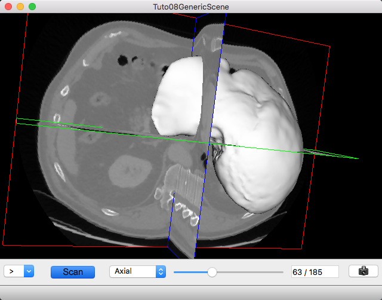
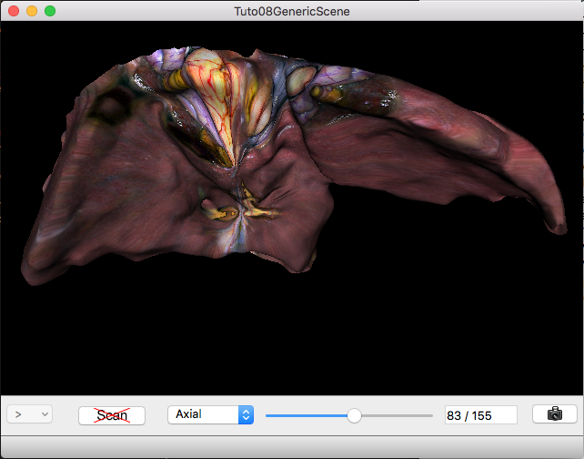
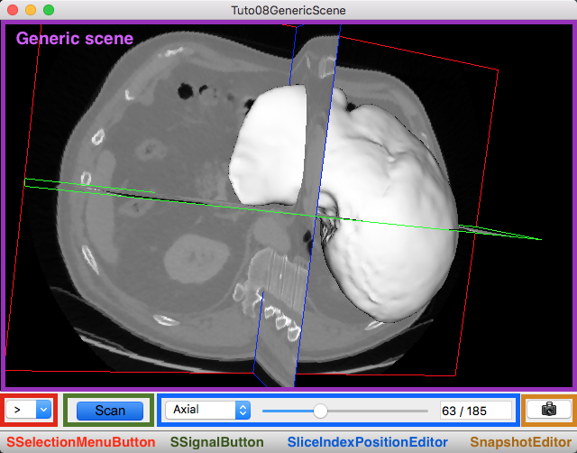
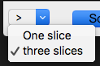

.. _tuto08:

********************************************
[*Tuto08GenericScene*] Generic scene
********************************************

This tutorial explains how to use the generic scene.

    
    Image and mesh
    

    
    Mesh with texture

Prerequisites
===============

Before to read this tutorial, you should have seen :
 * :ref:`generic_scene`
 * :ref:`tuto06`

Structure
=============

Properties.cmake
------------------

This file describes the project information and requirements :

.. code-block:: cmake

    set( NAME Tuto08GenericScene )
    set( VERSION 0.1 )
    set( TYPE APP )
    set( UNIQUE TRUE )
    set( DEPENDENCIES  )
    set( REQUIREMENTS
        dataReg
        servicesReg
        gui
        guiQt
        io
        ioData # contains reader/writer for mesh (.trian) or matrix (.trf)
        ioVTK
        uiIO
        uiVisuQt # contains several editors for visualization
        uiImageQt # contains several editors on image
        visuVTK
        visuVTKQt
        visuVTKAdaptor # contains adaptors for the generic scene
        ctrlSelection # contains services to manage object selection (and associated services)
        launcher
        appXml
    )

    bundleParam(appXml PARAM_LIST config PARAM_VALUES Tuto08GenericScene)

.. note::

    The Properties.cmake file of the application is used by CMake to compile the application but also to generate the
    ``profile.xml``: the file used to launch the application.

plugin.xml
------------

This file is in the ``rc/`` directory of the application. It defines the services to run.

.. code-block:: xml

    <!--
        This tutorial shows a VTK scene containing a 3D image and a textured mesh.
        To use this application, you should open a 3D image, a mesh and/or a 2D texture image.
    -->
    <plugin id="Tuto08GenericScene" version="@DASH_VERSION@">

        <requirement id="dataReg" />
        <requirement id="servicesReg" />
        <requirement id="visuVTKQt" />

        <extension implements="::fwServices::registry::AppConfig">
            <id>Tuto08GenericScene</id>
            <config>

                <object type="::fwData::Composite">
                    <service uid="MyIHM" impl="::gui::frame::SDefaultFrame">
                        <gui>
                            <frame>
                                <name>Tuto08GenericScene</name>
                                <icon>Bundles/Tuto08GenericScene_0-1/tuto.ico</icon>
                            </frame>
                            <menuBar />
                        </gui>
                        <registry>
                            <menuBar sid="myMenuBar" start="yes" />
                            <view sid="mainView" start="yes" />
                        </registry>
                    </service>

                    <!-- Status bar used to display the progress bar for reading -->
                    <service uid="progress_statusbar" impl="::gui::editor::SJobBar" />

                    <service uid="myMenuBar" impl="::gui::aspect::SDefaultMenuBar">
                        <gui>
                            <layout>
                                <menu name="File" />
                            </layout>
                        </gui>
                        <registry>
                            <menu sid="menu_File" start="yes" />
                        </registry>
                    </service>

                    <service uid="menu_File" impl="::gui::aspect::SDefaultMenu">
                        <gui>
                            <layout>
                                <menuItem name="Open image" shortcut="Ctrl+I" />
                                <menuItem name="Open mesh" shortcut="Ctrl+M" />
                                <menuItem name="Open texture" shortcut="Ctrl+T" />
                                <separator />
                                <menuItem name="Quit" specialAction="QUIT" shortcut="Ctrl+Q" />
                            </layout>
                        </gui>
                        <registry>
                            <menuItem sid="action_openImage" start="yes" />
                            <menuItem sid="action_openMesh" start="yes" />
                            <menuItem sid="action_openTexture" start="yes" />
                            <menuItem sid="action_quit" start="yes" />
                        </registry>
                    </service>

                    <!-- Actions to call readers -->
                    <service uid="action_openImage" impl="::gui::action::SStarter">
                        <start uid="imageReader" />
                    </service>
                    <service uid="action_openMesh" impl="::gui::action::SStarter">
                        <start uid="meshReader" />
                    </service>
                    <service uid="action_openTexture" impl="::gui::action::SStarter">
                        <start uid="textureReader" />
                    </service>

                    <!-- Quit action -->
                    <service uid="action_quit" impl="::gui::action::SQuit" />

                    <!-- main view -->
                    <service uid="mainView" impl="::gui::view::SDefaultView">
                        <gui>
                            <layout type="::fwGui::CardinalLayoutManager">
                                <view align="center" />
                                <view align="bottom" minWidth="400" minHeight="30" resizable="no" />
                            </layout>
                        </gui>
                        <registry>
                            <view sid="genericScene" start="yes" />
                            <view sid="editorsView" start="yes" />
                        </registry>
                    </service>

                    <!-- View for editors to update image visualization -->
                    <service uid="editorsView" impl="::gui::view::SDefaultView">
                        <gui>
                            <layout type="::fwGui::LineLayoutManager">
                                <orientation value="horizontal" />
                                <view proportion="0" minWidth="30" />
                                <view proportion="0" minWidth="50" />
                                <view proportion="1" />
                                <view proportion="0" minWidth="30" />
                            </layout>
                        </gui>
                        <registry>
                            <view sid="sliceListEditor" start="yes" />
                            <view sid="showScanEditor" start="yes" />
                            <view sid="sliderIndexEditor" start="yes" />
                            <view sid="snapshotScene1Editor" start="yes" />
                        </registry>
                    </service>

                    <!--
                        Editor used for scene snapshot:
                        It allows to select the snapshot filename and emits a "snapped" signal with this path.
                    -->
                    <service uid="snapshotScene1Editor" impl="::uiVisu::SnapshotEditor" />

                    <!--
                        Generic scene:
                        This scene display a 3D image and a textured mesh.
                    -->
                    <service uid="genericScene" impl="::fwRenderVTK::SRender" autoConnect="yes">
                        <scene>
                            <!-- Image picker -->
                            <picker id="myPicker" vtkclass="fwVtkCellPicker" />
                            <!-- Renderer -->
                            <renderer id="default" background="0.0" />

                            <!-- Mesh adapor -->
                            <adaptor id="meshAdaptor" class="::visuVTKAdaptor::Mesh" objectId="mesh">
                                <config renderer="default" picker="" uvgen="sphere" texture="textureAdaptor" />
                            </adaptor>

                            <!-- Texture adaptor, used by mesh adaptor -->
                            <adaptor id="textureAdaptor" class="::visuVTKAdaptor::Texture" objectId="textureImage">
                                <config renderer="default" picker="" filtering="linear" wrapping="repeat" />
                            </adaptor>

                            <!-- 3D image negatoscope adaptor -->
                            <adaptor id="imageAdaptor" uid="imageAdaptorUID" class="::visuVTKAdaptor::NegatoMPR" objectId="image">
                                <config renderer="default" picker="myPicker" mode="3d" slices="3" sliceIndex="axial" />
                            </adaptor>

                            <!-- Snapshot adaptor: create a snapshot of the scene. It has a slot "snap" that receives a path -->
                            <adaptor id="snapshotAdaptor" uid="snapshotUID" class="::visuVTKAdaptor::Snapshot" objectId="self">
                                <config renderer="default" />
                            </adaptor>

                            <!--
                                Connection for snapshot:
                                connect the editor signal "snapped" to the adaptor slot "snap"
                            -->
                            <connect>
                                <signal>snapshotScene1Editor/snapped</signal>
                                <slot>snapshotUID/snap</slot>
                            </connect>

                            <!--
                                Connection for 3D image slice:
                                Connect the button (showScanEditor) signal "toggled" to the image adaptor (MPRNegatoScene3D)
                                slot "showSlice", this signals/slots contains a boolean.
                                The image slices will be show or hide when the button is checked/unchecked.

                                The "waitForKey" attribut means that the signal and slot are connected only if the key
                                "image" is present in the scene composite. It is recommanded to used because the adaptors 
                                exists only if the object is present.
                            
                            -->
                            <connect waitForKey="image">
                                <signal>showScanEditor/toggled</signal>
                                <slot>imageAdaptorUID/showSlice</slot>
                            </connect>

                            <!--
                                Connection for 3D image slice:
                                Connect the menu button (sliceListEditor) signal "selected" to the image adaptor
                                (MPRNegatoScene3D) slot "updateSliceMode", this signals/slots contains an integer.
                                This integer defines the number of slice to show (0, 1 or 3).
                            -->
                            <connect waitForKey="image">
                                <signal>sliceListEditor/selected</signal>
                                <slot>imageAdaptorUID/updateSliceMode</slot>
                            </connect>

                        </scene>
                    </service>

                    <!-- *************************************************
                                        Displayed objects
                        ************************************************* -->

                    <!-- Image displayed in the scene -->
                    <item key="image">
                        <object uid="imageUID" type="::fwData::Image">

                            <service uid="imageReader" impl="::uiIO::editor::SIOSelector">
                                <type mode="reader" />
                            </service>

                            <!--
                                Generic editor representing a menu button.
                                It send signal with the current selected item.
                            -->
                            <service uid="sliceListEditor" impl="::guiQt::editor::SSelectionMenuButton">
                                <toolTip>Manage slice visibility</toolTip><!-- button tooltip -->
                                <selected>3</selected><!-- Default selection -->
                                <items>
                                    <item text="One slice" value="1" /><!-- first item, if selected the emitted value is "1" -->
                                    <item text="three slices" value="3" /><!-- second item, if selected the emitted value is "1" -->
                                </items>
                            </service>
                            <!--
                                Generic editor representing a simple button with an icon.
                                The button can be checkable. In this case it can have a second icon.
                                - It emits a signal "clicked" when it is clicked.
                                - It emits a signal "toggled" when it is checked/unchecked.

                                Here, this editor is used to show or hide the image. It is connected to the image adaptor.
                            -->
                            <service uid="showScanEditor" impl="::guiQt::editor::SSignalButton">
                                <config>
                                    <checkable>true</checkable>
                                    <icon>Bundles/media_0-1/icons/sliceHide.png</icon>
                                    <icon2>Bundles/media_0-1/icons/sliceShow.png</icon2>
                                    <iconWidth>40</iconWidth>
                                    <iconHeight>16</iconHeight>
                                    <checked>true</checked>
                                </config>
                            </service>

                            <!-- Editor representing a slider to navigate into image slices -->
                            <service uid="sliderIndexEditor" impl="::uiImage::SliceIndexPositionEditor" autoConnect="yes">
                                <sliceIndex>axial</sliceIndex>
                            </service>

                        </object>
                    </item>

                    <!-- texture displayed on the mesh -->
                    <item key="textureImage">
                        <object uid="textureUID" type="::fwData::Image">
                            <service uid="textureReader" impl="::uiIO::editor::SIOSelector">
                                <type mode="reader" />
                            </service>
                        </object>
                    </item>

                    <!-- Mesh displayed in the scene -->
                    <item key="mesh">
                        <object uid="meshUID" type="::fwData::Mesh">
                            <service uid="meshReader" impl="::uiIO::editor::SIOSelector">
                                <type mode="reader" />
                            </service>
                        </object>
                    </item>

                    <!-- Connects readers to status bar service -->
                    <connect>
                        <signal>meshReader/jobCreated</signal>
                        <slot>progress_statusbar/showJob</slot>
                    </connect>

                    <connect>
                        <signal>imageReader/jobCreated</signal>
                        <slot>progress_statusbar/showJob</slot>
                    </connect>

                    <connect>
                        <signal>textureReader/jobCreated</signal>
                        <slot>progress_statusbar/showJob</slot>
                    </connect>

                    <!--
                        Connects showScanEditor signal "toggled" to sliceListEditor slot "setEnable", this signal and slot
                        contains a boolean, so the sliceListEditor can be disabled when the image is not displayed.
                    -->
                    <connect>
                        <signal>showScanEditor/toggled</signal>
                        <slot>sliceListEditor/setEnabled</slot>
                    </connect>

                    <start uid="MyIHM" />
                    <start uid="progress_statusbar" />
                    <start uid="medicalImageConverter" />

                </object>

            </config>
        </extension>

    </plugin>

GUI
------

This tutorials used multiple editors to manage the image rendering: 

- show/hide image slices
- navigate between the image slices
- snapshot

The two editors (``SSelectionMenuButton`` and ``SSignalButton``) are generic, so we need to configure their behaviour in
the xml file.

The editor aspect is defined in the service configuration. They emit signals that must be manually connected to the 
scene adaptor.

SSelectionMenuButton
~~~~~~~~~~~~~~~~~~~~~~~

This editor displays a menu when the user click on the button. Then the user can select one item.

.. code-block:: xml

    <service uid="selectionMenuButton" impl="::uiImage::SSelectionMenuButton">
        <text>...</text>
        <toolTip>...</toolTip>
        <items>
            <item text="One" value="1" />
            <item text="Two" value="2" />
            <item text="Six" value="6" />
        </items>
        <selected>2</selected>
    </service>
    
text (optional, default ">")
    Text displayed on the button
    
toolTip (optional)
    Button tool tip
    
items
    List of the menu items

item
    One item
    
    text
        The text displayed in the menu
    value
        The value emitted when the item is selected
        
selected
    The value of the item selected by default 

When the user select an item, a signal is emitted: the signal is ``selected(int selection)``. It sends the value of 
the selected item.
    
In our case, we want to change the number of image slices displayed in the scene. So, we need to connect this signal to
the image adaptor slot ``updateSliceMode(int nbSlice)``.

.. code-block:: xml

    <connect>
        <signal>selectionMenuButton/selected</signal>
        <slot>imageAdaptor/updateSliceMode</slot>
    </connect>

SSignalButton
~~~~~~~~~~~~~~~

This editor shows a simple button.

.. code-block:: xml

    <service uid="signalButton" impl="::guiQt::editor::SSignalButton" >
        <config>
            <checkable>true|false</checkable>
            <text>...</text>
            <icon>...</icon>
            <text2>...</text2>
            <icon2>...</icon2>
            <checked>true|false</checked>
            <iconWidth>...</iconWidth>
            <iconHeight>...</iconHeight>
        </config>
    </service>

text (optional)
    Text displayed on the button
    
icon (optional)
    Icon displayed on the button

checkable (optional, default: false)
    If true, the button is checkable
    
text2 (optional) 
    Text displayed if the button is checked
    
icon2 (optional)
    Icon displayed if the button is checked
    
checked (optional, default: false)
    If true, the button is checked at start
    
iconWidth (optional)
    Icon width

iconHeight (optional)
    Icon height

This editor provides two signals:

clicked()
    Emitted when the user click on the button.

toggled(bool checked)
    Emitted when the button is checked or unchecked.
    
In our case, we want to show (or hide) the image slices when the button is checked (or unckecked). So, we need to 
connect the ``toogled`` signal to the image adaptor slot ``showSlice(bool show)``.

.. code-block:: xml

    <connect>
        <signal>signalButton/toggled</signal>
        <slot>imageAdaptor/showSlice</slot>
    </connect>

Run
=========

To run the application, you must call the following line into the install or build directory:

.. code::

    bin/launcher Bundles/Tuto08GenericScene_0-1/profile.xml
